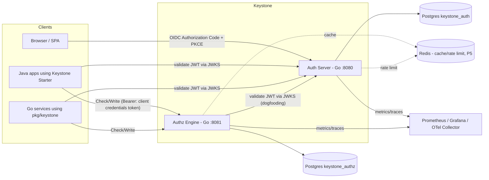
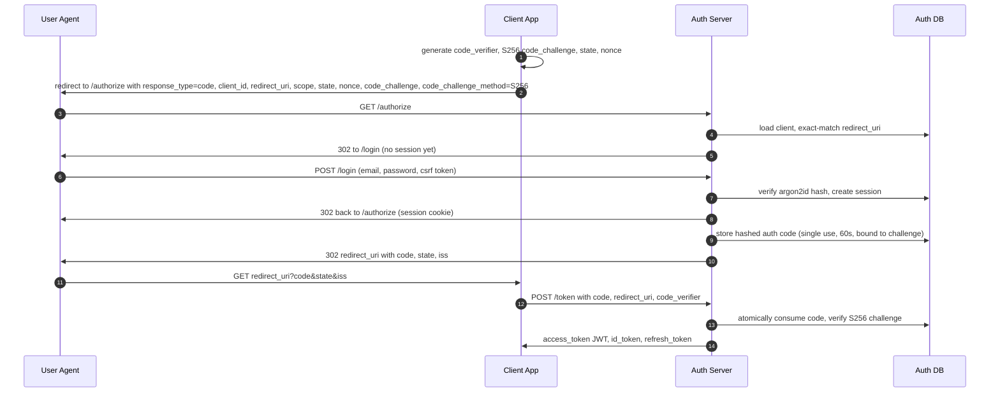
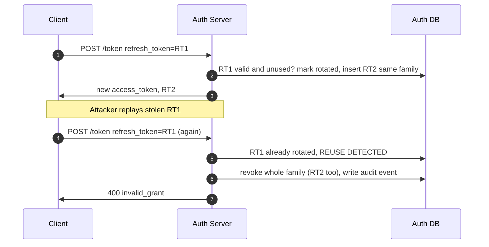

# KEYSTONE — Architecture & Implementation Reference

**Document version:** 1.0 · **Written:** 2026-10-03 · **Audience:** AI coding agents (Builder, Critic) and the human project owner
**Status:** Authoritative specification. If code and this document disagree, either fix the code or amend this document through an ADR (`docs/adr/`). Never diverge silently.

---

## 0. How to use this document

| Convention | Meaning |
|---|---|
| **MUST / MUST NOT / SHOULD / MAY** | RFC 2119 meaning. A MUST violation is a BLOCKER in review. |
| `[VERIFY]` | A fact that changes over time (library version, artifact name, CLI flag, cloud limit). Confirm against official docs or the package registry **before** relying on it. Never trust memory for these. |
| `[STRETCH]` | Optional. Do only after the phase Definition of Done (DoD) is fully met. |
| `P0`–`P5` | Phase tags. Section 12 defines the DoD for each phase. |
| `OWNER` | Placeholder for the human's GitHub username. Ask the human once, then record it in `docs/DEPENDENCIES.md`. |

**Reading order for agents:** §1 → §3 → the section for your current phase → §11 → §12 (your phase's DoD). Section 13 (pitfalls) must be re-read before any security-critical code is written or reviewed.

**Verified facts as of 2026-10-03** (checked against live sources while writing this document):

- Go **1.27.0** was released 2026-08-19; Go 1.26.x is still supported (Go supports the two most recent releases). Go 1.26.6 was the latest 1.26 patch on 2026-08-13.
- **Java 25 is an LTS** release (September 2025).
- **Spring Boot 4.1** is the current line (4.1.1 on 2026-08-20; it supports Java 17–26). Spring Boot 4.0's OSS support ends 2026-12-31, so **target 4.1.x**. Spring Boot 4 sits on Spring Framework 7 and Spring Security 7.
- In Boot 4.1 the artifact `spring-boot-starter-oauth2-resource-server` is marked **deprecated in favor of `spring-boot-starter-security-oauth2-resource-server`** `[VERIFY on start.spring.io / Maven Central]`.
- **RFC 9700** (OAuth 2.0 Security Best Current Practice, BCP 240, January 2025) is the current security baseline. It requires authorization servers to support PKCE, and requires refresh tokens for public clients to be sender-constrained or rotated.
- OWASP Password Storage Cheat Sheet: Argon2id minimum is **19 MiB memory, 2 iterations, 1 parallelism** (equivalent trade-offs: 46 MiB/1, 12 MiB/3, 9 MiB/4, 7 MiB/5).
- RFC 6238 §5.2: a TOTP verifier **MUST NOT accept the same OTP twice** after a successful validation. Libraries do not do this for you; Keystone must persist the last used time-step.
- The OpenID Foundation publishes a **conformance suite** (`gitlab.com/openid/conformance-suite`) that can be run locally with Docker. The `oidcc-basic-certification-test-plan` (discovery + static client variant) is the target for the stretch goal in P5.

> **Notation correction:** Zanzibar tuples are written `object#relation@subject`, e.g. `doc:1#editor@user:alice`. (An earlier planning note wrote it backwards as `user:alice#editor@doc:1`. Use the form in this document everywhere.)

---

## 1. Project definition

### 1.1 What Keystone is
A **self-hosted Identity & Authorization platform** that any application can plug into instead of re-implementing login and permissions:

1. **Auth Server (Go)** — OAuth 2.0 / OpenID Connect provider. Registers users, authenticates them (password + optional TOTP MFA), and issues signed tokens.
2. **Authz Engine (Go)** — Google-Zanzibar-inspired relationship-based access control (ReBAC) service with a `Check` API. RBAC is modeled as a special case.
3. **Spring Boot Starter (Java)** — drop-in library: add one dependency + a few properties, annotate methods with `@RequiresPermission`.
4. **Go SDK** (`pkg/keystone`) — the same convenience for Go services (JWT-validating middleware + `Check` client).
5. **Demo app** (Java) and examples that prove reuse.

### 1.2 Goals
- Be genuinely reusable: a new app integrates by (1) registering an OAuth client, (2) uploading an authorization schema, (3) adding the starter/SDK.
- Be standards-compliant where claimed, and honest where not (see §1.3).
- Be explainable: every design decision has a recorded reason (ADRs, §11.9) and an interview-ready answer (§14).
- Run with a single command: `docker compose up`.

### 1.3 Non-goals (state these honestly in the README)
No SAML. No social/federated login (`[STRETCH]` only). No multi-region/HA claims. No FIPS/compliance claims. No full admin UI (minimal server-rendered pages only). No DPoP/mTLS sender-constrained tokens (`[STRETCH]`). No device-code or implicit or password (ROPC) grants — the last two are **forbidden** by RFC 9700 / OAuth 2.1 direction. Not "production-grade": describe it as a *self-hosted IAM platform*.

### 1.4 Owner's success criteria
1. Public GitHub repo; green CI badge; `docker compose up` works from a clean clone.
2. README with architecture diagram, quickstart, security considerations, honest limitations.
3. At least three **real, reproducible** metrics recorded in `docs/METRICS.md` (e.g., authz checks/sec and p99 latency from k6; test coverage %; OIDF conformance result).
4. The owner can explain every component and trade-off in an interview (the Builder produces `docs/LEARNING/phase-N.md` for this purpose).

### 1.5 Naming
- Go module: `github.com/OWNER/keystone`
- Java groupId: `io.github.OWNER.keystone` (or `com.github.OWNER` if published via JitPack `[VERIFY]`)
- Docker image names: `keystone-authserver`, `keystone-authz`, `keystone-demo-docs`

---

## 2. Technology decisions

### 2.1 Stack table

| Area | Choice | Reason | Do NOT |
|---|---|---|---|
| Go | **1.27.x** (1.26.x acceptable) | Latest stable; `go fix` modernizers; mature stdlib | Pin to an old toolchain; ignore `govulncheck` |
| Go HTTP | stdlib `net/http` with method+path `ServeMux` patterns (`"POST /token"`) | Few dependencies, shows fundamentals | Pull in a heavy web framework |
| Go DB | `github.com/jackc/pgx/v5` (+ `pgxpool`) | Best-in-class Postgres driver | Use an ORM for the auth/authz core |
| Go queries | Hand-written SQL, optionally `sqlc` `[VERIFY]` | Reviewable, typed, no magic | String-concatenate SQL — **ever** |
| Migrations | `github.com/pressly/goose/v3` with embedded SQL `[VERIFY]` | Simple, embeddable | Run destructive migrations automatically in prod |
| Password hashing | `golang.org/x/crypto/argon2` (`IDKey`) + own PHC-string codec | OWASP first choice | bcrypt for new code; SHA-* for passwords; custom KDFs |
| JOSE/JWT (Go) | `github.com/go-jose/go-jose/v4` (+ `/jwt`) `[VERIFY latest]` | Maintained; JWKS types built in; explicit algorithm allowlists. `lestrrat-go/jwx` (v3/v4 exist; v4 has breaking changes) is an acceptable alternative — choose one, record an ADR | Hand-roll JWS/JWK; accept `alg` from the token header |
| TOTP | `github.com/pquerna/otp` (RFC 6238/4226) **plus Keystone's own replay guard** | Vetted algorithm implementation | Implement HMAC/truncation yourself; accept a code twice |
| Redis | `github.com/redis/go-redis/v9` `[VERIFY]` | Standard client (P5) | Make Redis a hard dependency for correctness |
| Logging | stdlib `log/slog`, JSON handler | Structured, zero deps | Log secrets/tokens/passwords |
| Metrics | `github.com/prometheus/client_golang` | De-facto standard | Label metrics with user IDs (cardinality bomb) |
| Tracing | OpenTelemetry Go SDK + `otelhttp` + `otelpgx` `[VERIFY]` | Vendor-neutral | Sample 100 % in prod by default |
| Rate limiting | `golang.org/x/time/rate` (P4, in-memory) → Redis sliding window (P5) | Simple first, distributed later | Trust `X-Forwarded-For` blindly |
| Go tests | `testing`, `testcontainers-go` (+ `modules/postgres`), native fuzzing, `-race` | Real Postgres in tests | Mock the database for repository tests |
| Go lint/sec | `golangci-lint`, `govulncheck`, `gosec`, `staticcheck` | Catch bugs early | Disable linters to make CI green |
| Database | **PostgreSQL 17+** `[VERIFY]`, two databases: `keystone_auth`, `keystone_authz` | Service-owned data, least-privilege roles | Share tables across services |
| Java | **Java 25 LTS** (Temurin) | Current LTS | Use preview features in the library |
| Java framework | **Spring Boot 4.1.x**, Spring Security 7.x, Maven 3.9+ with wrapper | Current line; Maven is simplest for publishing a starter | Use Boot 3.x or 4.0 (4.0 OSS support ends 2026-12-31) |
| Java JWT | Nimbus JOSE+JWT **via Spring Security's `oauth2-jose`** (transitive) | Don't pick a second JWT library | Add JJWT/other alongside it |
| Java cache | Caffeine | Standard in-process cache | Cache *allow* decisions longer than the configured TTL |
| Java tests | JUnit 5, AssertJ, Spring Security Test, Testcontainers, WireMock, `ApplicationContextRunner` | Cover autoconfig + integration | Test only the happy path |
| Containers | Multi-stage Dockerfiles; Go on distroless static `nonroot` `[VERIFY tag]`; Java on a Temurin 25 JRE image | Small, non-root | Run as root; bake secrets into images |
| CI | GitHub Actions | Free for public repos | Skip CI on `main` |
| Load test | **k6** | Scriptable, p99 reporting | Publish numbers without hardware + dataset description |

### 2.2 Dependency hygiene rules
1. **Pin at Phase 0**: the Builder runs `go list -m -u all` / checks Maven Central and records chosen versions + date in `docs/DEPENDENCIES.md`.
2. Enable **Dependabot** (Go modules, Maven, GitHub Actions, Docker).
3. CI runs `govulncheck ./...` and a Java dependency audit (`osv-scanner` or OWASP Dependency-Check) `[VERIFY tooling]`.
4. No abandoned dependencies (no release or commit activity in 24 months → needs an ADR).
5. **Never** write cryptographic primitives. Compose vetted ones. Randomness: `crypto/rand` only (never `math/rand`).

---

## 3. System architecture

### 3.1 Component diagram



### 3.2 Runtime topology

| Service | Default port | Role | Data store | Notes |
|---|---|---|---|---|
| `authserver` | 8080 (public), 9100 (metrics/health) | OAuth2/OIDC provider, login UI, SCIM (P5) | `keystone_auth` | Stateless; any replica can serve any request |
| `authz` | 8081 (API), 9101 (metrics/health) | ReBAC engine | `keystone_authz` | Protected by tokens from `authserver` |
| `postgres` | 5432 | Storage | — | Two databases, two least-privilege roles |
| `redis` | 6379 | P5 only | — | Cache + rate limit; never the source of truth |
| `demo-docs` | 8082 | Java demo resource server | in-memory/H2 or Postgres | Proves the starter |
| `prometheus`/`grafana`/`otel-collector` | 9090/3000/4317 | Optional profile `observability` | — | P5 |

### 3.3 Key sequences

**(a) Login with Authorization Code + PKCE**


**(b) API call with an authorization check**
```mermaid
sequenceDiagram
    autonumber
    participant C as Client
    participant S as Resource Server (Starter)
    participant A as Auth Server
    participant Z as Authz Engine
    C->>S: PUT /docs/42 with Authorization: Bearer access_token
    S->>A: GET /jwks.json (cached; refetch on unknown kid, rate limited)
    S->>S: verify signature, alg allowlist, typ=at+jwt, iss, aud, exp
    S->>Z: POST /v1/check doc:42 edit user:sub (service token)
    Z->>Z: evaluate schema + tuples at consistent revision
    Z->>S: allowed true/false
    S->>C: 200 or 403 (fail closed if Z unreachable)
```

**(c) Refresh token rotation with reuse detection**


### 3.4 Architectural principles
1. **Fail closed.** Any error in authentication or authorization yields deny — never allow.
2. **Defense in depth.** Validate at every boundary; do not assume an upstream check happened.
3. **Least privilege.** Separate DB roles per service; the audit table is INSERT-only for the app role.
4. **Stateless services**, state in Postgres (and optionally Redis for *performance only*).
5. **Boring technology.** Stdlib first; each dependency needs a reason.
6. **Everything observable.** Structured logs, metrics, traces, audit events — without leaking secrets.
7. **Dogfooding.** The Authz Engine authenticates callers with tokens issued by the Auth Server.

---

## 4. Repository layout (monorepo)

```
keystone/
├── README.md                     # pitch, diagram, quickstart, security notes, metrics, limitations
├── LICENSE                       # Apache-2.0 (patent grant) — record choice in ADR
├── SECURITY.md                   # how to report vulns; supported versions; known limitations
├── Makefile                      # up, down, test, lint, vuln, fmt, e2e, bench, gen
├── docker-compose.yml            # postgres, redis(profile), authserver, authz, demo-docs
├── docker-compose.observability.yml
├── .github/
│   ├── workflows/ci.yml          # lint, vet, test -race, govulncheck, java verify, docker build, openapi lint
│   ├── workflows/release.yml     # tag -> images + GitHub release
│   ├── workflows/conformance.yml # nightly/optional OIDF suite run (P5)
│   └── dependabot.yml
├── api/openapi/                  # authserver.yaml, authz.yaml, scim.yaml (OpenAPI 3.1)
├── docs/
│   ├── ARCHITECTURE.md           # derived from this document; diagrams
│   ├── KEYSTONE_REFERENCE.md     # this file (source of truth)
│   ├── THREAT_MODEL.md  SECURITY_CONSIDERATIONS.md
│   ├── DEPENDENCIES.md  METRICS.md  BENCHMARKS.md
│   ├── adr/0001-*.md ...
│   └── LEARNING/phase-0.md ... phase-5.md   # owner study notes + interview Q&A
├── cmd/
│   ├── authserver/main.go
│   ├── authz/main.go
│   └── keystonectl/main.go       # CLI: user/client create, keys rotate, audit verify, schema push
├── internal/
│   ├── platform/                 # config, logging, httpx (middleware), db, crypto, ids, clock, telemetry, ratelimit
│   ├── auth/                     # password, session, oauth (authorize/token), oidc, token, keys, mfa, audit, scim, ui, store
│   └── authz/                    # schema (parser+validator), store, engine, api, cache, zookie
├── pkg/keystone/                 # PUBLIC Go SDK: JWT middleware + authz client
├── migrations/                   # auth/*.sql, authz/*.sql, embed.go
├── web/                          # templates/*.html, static/ (no CDN, no inline scripts)
├── java/                         # Maven multi-module
│   ├── pom.xml
│   ├── keystone-client/                       # plain-Java client for authz API (java.net.http)
│   ├── keystone-spring-boot-autoconfigure/    # auto-config, properties, method security
│   ├── keystone-spring-boot-starter/          # empty jar that pulls the above
│   └── keystone-demo-docs/                    # Spring Boot demo resource server
├── examples/
│   ├── spa-pkce/                 # single static HTML page performing PKCE login
│   └── go-resource-server/       # tiny Go service using pkg/keystone
├── test/
│   ├── integration/              # Go, Testcontainers
│   ├── e2e/                      # compose-based end-to-end scripts
│   ├── critic-repro/             # reproduction tests contributed by the Critic and promoted by the Builder
│   ├── conformance/              # OIDF suite configs
│   └── load/                     # k6 scripts
├── deploy/
│   ├── docker/                   # Dockerfiles
│   └── terraform/aws/            # [STRETCH] ECS Fargate + RDS + ElastiCache
└── scripts/                      # dev helpers (gen keys, wait-for, seed)
```

Rules: Go code under `internal/` is not importable by outside modules — only `pkg/keystone` is public API. No business logic in `cmd/`. One concept per package.

---

## 5. Standards conformance matrix

| Standard | What Keystone does | Phase | Verified by |
|---|---|---|---|
| RFC 6749 OAuth 2.0 | Authorization Code, Client Credentials, Refresh Token grants; error formats; no implicit, no ROPC | P1 | integration + OIDF suite |
| RFC 7636 PKCE | **Mandatory for all clients**, S256 only | P1 | negative tests (§12 P1) |
| RFC 9700 OAuth Security BCP | Exact redirect URI match; PKCE; refresh rotation + reuse detection; short-lived access tokens; no tokens in URLs; `iss` response param | P1 | critic probes AS-* |
| RFC 9207 `iss` in auth response | Add `iss` to every authorization response; advertise in metadata | P1 | unit + e2e |
| OIDC Core 1.0 (code flow) | ID token, `nonce`, `at_hash`, `auth_time`, `/userinfo`, scopes `openid profile email` | P1 | OIDF Basic OP plan (P5) |
| OIDC Discovery 1.0 + RFC 8414 | `/.well-known/openid-configuration` (and OAuth AS metadata alias). `RS256` MUST appear in `id_token_signing_alg_values_supported` | P1 | schema test |
| RFC 7517/7518/7515/7519 JWK/JWA/JWS/JWT | RS256 signing, JWKS | P1 | unit |
| RFC 7638 JWK Thumbprint | `kid` = thumbprint | P1 | unit |
| RFC 9068 JWT Access Token profile | `typ: at+jwt`; claims `iss sub aud exp iat jti client_id scope` | P1 | unit + verifier tests |
| RFC 6750 Bearer tokens | `Authorization: Bearer`; `WWW-Authenticate` on 401 | P1 | integration |
| RFC 9106 Argon2 / OWASP | argon2id, PHC strings, parameters ≥ OWASP minimum | P1 | unit |
| RFC 7009 Token Revocation | `/revoke` | P4 | integration |
| RFC 7662 Token Introspection | `/introspect` | P4 | integration |
| RFC 6238 / 4226 TOTP/HOTP | TOTP MFA + replay guard + recovery codes | P4 | RFC test vectors + replay test |
| OIDC RP-Initiated Logout 1.0 | `/logout` | P4 | e2e |
| RFC 7642/7643/7644 SCIM 2.0 | `/scim/v2/Users`, `/Groups`, discovery endpoints | P5 | SCIM probe suite |
| RFC 9457 Problem Details | JSON errors on non-OAuth APIs (authz, admin) | P2 | schema test |
| Zanzibar (USENIX ATC 2019) | tuples, userset rewrites, snapshot reads, zookies | P2 | differential tests vs. oracle |
| RFC 8707 Resource Indicators | `audience`/`resource` handling | `[STRETCH]` | — |
| RFC 7591 Dynamic Client Registration | `/register` | `[STRETCH]` | — |
| RFC 9449 DPoP | sender-constrained tokens | `[STRETCH]` | — |

---

## 6. Auth Server specification (Go)

### 6.1 Endpoint catalogue

| Method + Path | Purpose | Auth | Phase |
|---|---|---|---|
| `GET /.well-known/openid-configuration` | OIDC discovery | none | P1 |
| `GET /.well-known/oauth-authorization-server` | RFC 8414 alias (same document) | none | P1 |
| `GET /jwks.json` | Public signing keys (JWKS) | none | P1 |
| `GET /authorize` | Authorization endpoint | session cookie | P1 |
| `POST /token` | Token endpoint | client auth | P1 |
| `GET, POST /userinfo` | OIDC UserInfo | Bearer access token | P1 |
| `GET, POST /login` | Login form | CSRF token | P1 |
| `GET, POST /register` | Self-registration form | CSRF token | P1 |
| `GET, POST /consent` | Consent screen (for clients with `require_consent`) | session + CSRF | P1 |
| `GET, POST /mfa` | TOTP challenge | login challenge + CSRF | P4 |
| `GET, POST /account/mfa` | TOTP enrollment/disable, recovery codes | session + CSRF | P4 |
| `POST /revoke` | RFC 7009 revocation | client auth | P4 |
| `POST /introspect` | RFC 7662 introspection | client auth | P4 |
| `GET, POST /logout` | RP-initiated logout | optional `id_token_hint` | P4 |
| `/scim/v2/*` | SCIM 2.0 | Bearer, scope `scim` | P5 |
| `GET /healthz`, `GET /readyz` | liveness / readiness (readiness checks DB + signing key present) | none (metrics port) | P0 |
| `GET /metrics` | Prometheus | none (metrics port only, never public) | P5 |

CLI instead of an admin API for P1–P4: `keystonectl user create`, `keystonectl client create` (prints the client secret **once**), `keystonectl keys rotate`, `keystonectl audit verify`. An admin REST API is `[STRETCH]`.

### 6.2 Configuration (environment variables, 12-factor)

The process MUST validate configuration at startup and exit non-zero with a clear message on error. `KEYSTONE_ENV=dev|prod`: in `prod`, refuse to start if the issuer is not `https://`, the master key is missing/short, cookies are not `Secure`, or Argon2 parameters are below the OWASP minimum.

| Variable | Default | Notes |
|---|---|---|
| `KEYSTONE_ENV` | `dev` | `prod` enables strict validation |
| `KEYSTONE_ISSUER` | — (required) | Exact `iss` value, no trailing slash. Must match discovery |
| `KEYSTONE_HTTP_ADDR` | `:8080` | Public listener |
| `KEYSTONE_ADMIN_ADDR` | `:9100` | `/healthz`, `/readyz`, `/metrics` |
| `KEYSTONE_DB_URL` | — (required) | `postgres://keystone_auth_app:…@postgres:5432/keystone_auth` |
| `KEYSTONE_MASTER_KEY` | — (required) | base64, 32 bytes. Encrypts private signing keys and TOTP secrets at rest (AES-256-GCM). Support `_FILE` suffix variants for Docker secrets |
| `KEYSTONE_COOKIE_SECURE` | `true` | `__Host-` cookie prefix only when `true` |
| `KEYSTONE_ACCESS_TOKEN_TTL` | `10m` | Allowed range 1m–1h |
| `KEYSTONE_ID_TOKEN_TTL` | `10m` | |
| `KEYSTONE_AUTH_CODE_TTL` | `60s` | RFC 6749 recommends ≤ 10 min; shorter is better |
| `KEYSTONE_REFRESH_IDLE_TTL` | `720h` (30 d) | Sliding |
| `KEYSTONE_REFRESH_ABSOLUTE_TTL` | `2160h` (90 d) | Hard cap per family |
| `KEYSTONE_REFRESH_REUSE_GRACE` | `0s` | Optional tolerance for client retry races; default is strict. Document the trade-off if > 0 (max 10 s) |
| `KEYSTONE_SESSION_IDLE_TTL` / `_ABSOLUTE_TTL` | `30m` / `12h` | |
| `KEYSTONE_ARGON2_MEMORY_KIB` | `65536` | 64 MiB (above OWASP minimum of 19 MiB) |
| `KEYSTONE_ARGON2_TIME` | `3` | |
| `KEYSTONE_ARGON2_PARALLELISM` | `2` | |
| `KEYSTONE_ARGON2_MAX_CONCURRENT` | `4` | Semaphore; protects memory (each hash allocates `m` KiB) |
| `KEYSTONE_PASSWORD_PEPPER` | unset | `[STRETCH]` HMAC pepper applied before hashing; stored outside the DB |
| `KEYSTONE_RATE_LIMIT_*` | see §6.12 | |
| `KEYSTONE_REDIS_URL` | unset | P5 |
| `OTEL_*` | unset | Standard OpenTelemetry env vars |

### 6.3 Authorization endpoint (`GET /authorize`)

**Accepted parameters:** `response_type` (only `code`), `client_id`, `redirect_uri`, `scope`, `state`, `code_challenge`, `code_challenge_method` (only `S256`), `nonce`, `prompt` (`none|login|consent`), `max_age`, `login_hint`, `audience` (optional API audience).

**Validation order (security-critical — do not reorder):**
1. Look up `client_id`. Unknown/disabled → render an **error page**. **Do not redirect.**
2. `redirect_uri`: MUST **exactly string-match** one registered URI (no prefix, no wildcard, no case folding, no normalization games). Required even if the client registered one URI. Mismatch → error page, **do not redirect** (prevents open-redirect abuse).
3. Only after 1–2 succeed may errors be returned via redirect (`error`, `error_description`, `state`, `iss`).
4. `response_type=code` else `unsupported_response_type`. Any `token`/`id_token` types are rejected.
5. PKCE: `code_challenge` required for **all** clients, `code_challenge_method=S256` required (`plain` rejected). Challenge is 43 chars of base64url (`BASE64URL(SHA256(verifier))`).
6. `scope` ⊆ client's `allowed_scopes` else `invalid_scope`. If `openid` ∈ scope the request is an OIDC request.
7. `prompt=none` with no session → `login_required` redirect (never render UI). With consent needed → `consent_required`.

**Flow:** no valid session or `prompt=login`/`max_age` exceeded → `302 /login?return_to=<relative /authorize?… URL>`. `return_to` MUST be validated as a **relative path starting with `/authorize`** (open-redirect defense), and the full validation above re-runs when the user returns. If the client requires consent and no stored consent covers the scope → `/consent`. Otherwise generate the authorization code (§6.5) and redirect: `redirect_uri?code=…&state=…&iss=<issuer>`.

### 6.4 Token endpoint (`POST /token`, `application/x-www-form-urlencoded`)

**Client authentication:** `client_secret_basic` (default for confidential), `client_secret_post`, `none` (public clients — PKCE is the protection). Compare secret hashes with `subtle.ConstantTimeCompare`. Client secrets are 32+ random bytes, base64url, shown once; stored as **SHA-256** (high-entropy secrets do not need a slow KDF). Failure → `401 invalid_client` (+ `WWW-Authenticate: Basic` if Basic was attempted).

**Grants:**

1. `authorization_code`
   - Require `code`, `redirect_uri` (must equal the one used at `/authorize`), `code_verifier` (43–128 chars of `[A-Za-z0-9-._~]`).
   - Consume the code **atomically**: `UPDATE authorization_codes SET used_at = now() WHERE code_hash = $1 AND used_at IS NULL AND expires_at > now() RETURNING …`. Zero rows ⇒ `invalid_grant`.
   - If the code was **already used**, RFC 6749 §4.1.2 requires denial and recommends revoking tokens issued from it: revoke the refresh-token family and record an audit event `auth_code.reuse_detected`.
   - Verify `BASE64URL(SHA256(code_verifier)) == stored code_challenge` with constant-time compare. Verify `client_id` matches the code's client.
   - Issue access token (JWT), ID token if `openid`, refresh token if the client allows `refresh_token`.
2. `refresh_token` — rotation with reuse detection (§6.6).
3. `client_credentials` — **confidential clients only**. `sub = client_id`. No refresh token, no ID token. Scopes ⊆ client's allowed scopes.

Any other `grant_type` → `unsupported_grant_type`. The `password` and `implicit` grants MUST NOT exist.

**Response:** JSON with `Cache-Control: no-store` and `Pragma: no-cache` (RFC 6749 §5.1): `{access_token, token_type:"Bearer", expires_in, refresh_token?, id_token?, scope}`.

**Errors (RFC 6749 §5.2):** `400` with `{"error": "...", "error_description": "..."}` for `invalid_request`, `invalid_grant`, `invalid_scope`, `unsupported_grant_type`, `unauthorized_client`; `401` for `invalid_client`. Descriptions are generic (no secrets, no internal detail). Rate-limited → `429` with `Retry-After`.

### 6.5 Authorization codes
- 32 random bytes from `crypto/rand`, base64url. **Store only SHA-256(code)**.
- TTL `KEYSTONE_AUTH_CODE_TTL` (default 60 s). Single use. Bound to `client_id`, `redirect_uri`, `code_challenge`, `user_id`, `scope`, `nonce`, `auth_time`, `amr`, `session_id`.
- A background job deletes expired rows.

### 6.6 Refresh tokens: rotation, families, reuse detection
- Opaque, 32 random bytes, base64url; **store SHA-256 only**.
- Table columns: `family_id` (constant across rotations), `parent_id`, `rotated_at`, `revoked_at`, `expires_at` (idle, sliding), `absolute_expires_at` (family cap).
- **On use** (inside a single DB transaction):
  1. `SELECT … FOR UPDATE` the row by hash.
  2. Not found / expired / revoked / wrong client → `invalid_grant`.
  3. If `rotated_at IS NOT NULL` ⇒ **REUSE DETECTED**: revoke every token in the family (`revoked_at = now(), revoked_reason = 'reuse_detected'`), write audit event, return `invalid_grant`. (With `KEYSTONE_REFRESH_REUSE_GRACE > 0`, a reuse within the grace window of the rotation is not treated as an attack but still returns `invalid_grant` — document this.)
  4. Otherwise set `rotated_at = now()`, insert the child (same `family_id`, `parent_id`), return the new token.
- Requested `scope` on refresh MAY narrow but MUST NOT widen the original grant.
- Revoking a session or user disables the families bound to it.
- **Concurrency requirement:** 50 parallel refreshes of the same token produce exactly one success (with grace 0).

### 6.7 Tokens

**Access token** — JWT, RS256, header `{"alg":"RS256","typ":"at+jwt","kid":"<thumbprint>"}` (RFC 9068).

| Claim | Value |
|---|---|
| `iss` | `KEYSTONE_ISSUER` |
| `sub` | user UUID (or `client_id` for client-credentials) |
| `aud` | the API audience (from `audience` param ∩ client `allowed_audiences`; else the client's default audience). Single string or array |
| `exp`, `iat`, `nbf` | `iat = now`, `exp = now + TTL` |
| `jti` | UUID (used for revocation deny-list in P4) |
| `client_id` | OAuth client |
| `scope` | space-delimited string |
| `sid` | session id (user tokens) |
| `amr` | e.g. `["pwd"]`, `["pwd","otp"]` (P4) |
| `tenant` | `[STRETCH]` for multi-tenant apps; the Authz Engine tenant defaults to `client_id` |

**ID token** (OIDC): `iss`, `sub`, `aud = client_id`, `exp`, `iat`, `auth_time`, `nonce` (if sent), `at_hash` (left half of SHA-256 of the access token's ASCII, base64url), `amr`, `sid`; plus claims for granted scopes (`profile` → `name`, `preferred_username`, `updated_at`; `email` → `email`, `email_verified`). Header `typ` is `JWT`. The ID token MUST NOT be accepted by APIs as an access token (verifiers check `typ` and `aud`).

**UserInfo:** requires a valid access token with scope `openid`; returns claims per granted scopes; `sub` always present and equal to the ID token `sub`.

**Verification rules (apply in Go SDK, Authz Engine, and the Java starter):**
1. Algorithm **allowlist = `RS256` only**. Never read the algorithm from the token to choose a verification method. Reject `none`, `HS*` (algorithm-confusion attack), and anything else.
2. Select the key by `kid` from the cached JWKS. Unknown `kid` → refetch the JWKS **at most once per 30 s**, then reject.
3. Check `typ == at+jwt` (case-insensitive compare per RFC 9068), `iss` exact match, `aud` contains the expected audience, `exp`/`nbf` with ≤ 30 s leeway, required claims present.
4. Never log tokens.

### 6.8 Signing keys & rotation
- RSA ≥ 2048 bits (3072 recommended) generated with `crypto/rsa` + `crypto/rand`. `kid` = RFC 7638 JWK thumbprint (base64url SHA-256).
- `signing_keys` table: `kid, alg, public_jwk (jsonb), private_enc (bytea), status, created_at, activate_at, retire_at`. `status ∈ pending | active | retired | revoked`.
- Private keys encrypted with **AES-256-GCM** using `KEYSTONE_MASTER_KEY`; random 12-byte nonce per encryption; AAD = `kid`. (State plainly in SECURITY_CONSIDERATIONS that production should use a KMS/HSM; provide a `KeyWrapper` interface with the local implementation and an `[STRETCH]` AWS KMS implementation.)
- **Rotation procedure** (`keystonectl keys rotate`, also scheduled):
  1. Generate new key → `pending`; it appears in JWKS immediately (so verifiers cache it).
  2. After `propagation_delay` (≥ JWKS `max-age` + safety margin, default 1 h) promote to `active` (used for signing); old active → `retired`.
  3. A retired key stays in JWKS until `max token TTL + JWKS cache TTL` has elapsed, then is removed from JWKS and marked for deletion.
- `/jwks.json` returns **only public** members (`kty, n, e, kid, alg, use`) with `Cache-Control: public, max-age=300`. A test MUST assert no private member (`d, p, q, dp, dq, qi`) can ever be serialized.
- Readiness fails if no `active` key exists. On first boot with an empty table, generate one.

### 6.9 Passwords
- Hash: **argon2id**, salt 16 bytes (`crypto/rand`), key length 32. Encode as PHC string `$argon2id$v=19$m=65536,t=3,p=2$<b64salt>$<b64hash>` (standard base64, no padding).
- Verify with `subtle.ConstantTimeCompare`; parse parameters from the stored string (so parameters can evolve). **Rehash on successful login** if stored parameters differ from current config.
- **No user enumeration:** for unknown emails, still run a verification against a precomputed dummy hash so response time is comparable; return the identical generic error.
- Limit concurrent hashes with a semaphore (`KEYSTONE_ARGON2_MAX_CONCURRENT`); on saturation return `503`/`429` quickly rather than exhausting memory.
- Policy (NIST SP 800-63B spirit): minimum **12** characters, maximum **128** (reject longer to bound hashing cost), allow all printable Unicode and spaces, **no composition rules**, normalize with NFKC before hashing, reject a small embedded list of top breached passwords. `[STRETCH]` check against Have I Been Pwned's k-anonymity range API with a short timeout and a configurable fail-open/closed policy.
- Emails: trim + lowercase; unique via `lower(email)` index. Registration response MUST NOT reveal whether an email already exists if email verification is enabled (`[STRETCH]`); in the MVP, document the trade-off.

### 6.10 Sessions & cookies
- Session ID: 32 random bytes; store SHA-256 in `sessions`. **Regenerate the session ID on login** (fixation defense).
- Cookie: `__Host-keystone_session` (when `KEYSTONE_COOKIE_SECURE=true`; requires `Secure`, `Path=/`, no `Domain`), `HttpOnly`, `SameSite=Lax`.
- Idle timeout 30 min, absolute 12 h; `prompt=login` / `max_age` force re-auth.
- **CSRF:** every state-changing HTML form carries a per-session synchronizer token (or HMAC-signed double-submit token bound to the session); verify with constant-time compare. `/login` uses a pre-session CSRF cookie. `SameSite` is defense-in-depth, not the only control.
- HTML responses: `Content-Security-Policy: default-src 'self'; frame-ancestors 'none'; form-action 'self'; base-uri 'none'`, `X-Content-Type-Options: nosniff`, `Referrer-Policy: no-referrer`, `Cache-Control: no-store`. **No inline scripts, no CDN assets.** Use `html/template` (auto-escaping) only.

### 6.11 Errors, validation, and HTTP hardening
- `http.Server` with `ReadHeaderTimeout`, `ReadTimeout`, `WriteTimeout`, `IdleTimeout`; `http.MaxBytesReader` (e.g., 64 KiB for forms); graceful shutdown on SIGTERM; panic-recovery middleware returning generic 500; `X-Request-ID` generated/propagated and included in logs.
- Reject unknown/duplicated parameters where the spec says so (e.g., repeated `code`, `grant_type`).
- CORS: `discovery` and `jwks` are public (`Access-Control-Allow-Origin: *`, GET only). The token and userinfo endpoints allow CORS **only** for origins derived from registered public-client redirect URIs `[STRETCH]`; default is no CORS.
- Never return stack traces or SQL errors to clients. Log them (without secrets) with the request ID.

### 6.12 Rate limiting & lockout (P4)
- Token bucket per IP on `/login`, `/token`, `/register`, `/mfa` (`x/time/rate`, in-memory; P5 moves to Redis). Client IP = `RemoteAddr`, or the right-most-untrusted entry of `X-Forwarded-For` **only if** `KEYSTONE_TRUSTED_PROXIES` lists the proxy.
- Per-account lockout: after 5 failed password attempts within 15 min, require a cool-down (15 min, exponential on repeats up to a cap). **Temporary only** (permanent lockout is a DoS vector). Responses stay generic and indistinguishable from a wrong password. Audit events `auth.login_failed`, `auth.lockout`.
- `429` + `Retry-After` for rate limiting.

### 6.13 TOTP MFA (P4)
- Enrollment (`/account/mfa`): generate a 160-bit secret; show the `otpauth://` URI and QR (server-side QR rendering, no third-party service); **activate only after the user submits a valid code**.
- Parameters: SHA-1, 6 digits, 30 s period (the interoperable set), accept ±1 step.
- **Replay guard (RFC 6238 §5.2):** persist `last_used_step` per credential; reject any code whose matched step ≤ `last_used_step`. Update atomically (`UPDATE … SET last_used_step = $s WHERE id = $id AND last_used_step < $s`).
- Secret encrypted at rest (AES-256-GCM, master key; AAD = credential id).
- 10 single-use **recovery codes** (≥ 50 bits entropy each), stored hashed; shown once.
- Login with MFA: after password success create a `login_challenges` row (5 min TTL, attempt counter ≤ 5), **not** a session. `/mfa` upgrades it to a session and sets `amr=["pwd","otp"]`.
- Rate-limit MFA attempts independently of passwords.
- Test against RFC 6238 Appendix B test vectors.

### 6.14 Audit log (P4; start emitting events in P1)
- Table `audit_events` (see DDL) — **append-only**:
  - The app's DB role has `INSERT, SELECT` only on the table.
  - A trigger raises an exception on `UPDATE`, `DELETE`, `TRUNCATE`.
  - **Hash chain:** `hash = SHA256(prev_hash || canonical_json(event_without_hash))`, computed in a transaction holding `pg_advisory_xact_lock` so the chain is linear. `keystonectl audit verify` recomputes the chain and reports the first broken link.
- Events (minimum): `user.registered`, `auth.login_succeeded`, `auth.login_failed`, `auth.lockout`, `auth.mfa_enrolled`, `auth.mfa_failed`, `session.created`, `session.revoked`, `token.issued` (grant type, client, scope; **not** the token), `refresh_token.reuse_detected`, `auth_code.reuse_detected`, `token.revoked`, `client.created`, `key.rotated`, `scim.user_created|updated|deleted`. Authz Engine writes its own: `authz.schema_written`, `authz.tuple_written|deleted`, `authz.check_denied` (sampled).
- Fields: `ts, actor_type, actor_id, action, target_type, target_id, outcome, ip, user_agent, request_id, metadata(jsonb), prev_hash, hash`. **Never** store passwords, tokens, codes, secrets, or full headers. IP/user-agent are personal data: document retention.

### 6.15 Data model (auth database) — reference DDL

```sql
-- migrations/auth/0001_init.sql  (goose Up)
CREATE TABLE users (
  id               uuid PRIMARY KEY,                          -- UUIDv7 generated by the app
  email            text NOT NULL,
  email_verified   boolean NOT NULL DEFAULT false,
  username         text,
  display_name     text,
  password_hash    text NOT NULL,                             -- PHC string
  status           text NOT NULL DEFAULT 'active' CHECK (status IN ('active','disabled')),
  external_id      text,                                      -- SCIM externalId
  mfa_enabled      boolean NOT NULL DEFAULT false,
  failed_login_count int NOT NULL DEFAULT 0,
  locked_until     timestamptz,
  version          int NOT NULL DEFAULT 1,                    -- optimistic lock + SCIM ETag
  created_at       timestamptz NOT NULL DEFAULT now(),
  updated_at       timestamptz NOT NULL DEFAULT now()
);
CREATE UNIQUE INDEX users_email_lower_uq    ON users (lower(email));
CREATE UNIQUE INDEX users_username_lower_uq ON users (lower(username)) WHERE username IS NOT NULL;
CREATE UNIQUE INDEX users_external_id_uq    ON users (external_id)     WHERE external_id IS NOT NULL;

CREATE TABLE clients (
  id                          uuid PRIMARY KEY,
  client_id                   text NOT NULL UNIQUE,
  client_secret_hash          bytea,                          -- SHA-256; NULL for public clients
  name                        text NOT NULL,
  client_type                 text NOT NULL CHECK (client_type IN ('public','confidential')),
  token_endpoint_auth_method  text NOT NULL CHECK (token_endpoint_auth_method IN ('none','client_secret_basic','client_secret_post')),
  redirect_uris               text[] NOT NULL DEFAULT '{}',
  post_logout_redirect_uris   text[] NOT NULL DEFAULT '{}',
  allowed_grant_types         text[] NOT NULL,
  allowed_scopes              text[] NOT NULL,
  allowed_audiences           text[] NOT NULL DEFAULT '{}',
  default_audience            text,
  require_consent             boolean NOT NULL DEFAULT true,
  access_token_ttl_seconds    int,
  created_at                  timestamptz NOT NULL DEFAULT now(),
  disabled_at                 timestamptz,
  CHECK ( (client_type = 'public') = (client_secret_hash IS NULL) )
);

CREATE TABLE sessions (
  id_hash       bytea PRIMARY KEY,                            -- SHA-256(session id)
  user_id       uuid NOT NULL REFERENCES users(id) ON DELETE CASCADE,
  auth_time     timestamptz NOT NULL,
  amr           text[] NOT NULL,
  ip            inet, user_agent text,
  created_at    timestamptz NOT NULL DEFAULT now(),
  last_seen_at  timestamptz NOT NULL DEFAULT now(),
  expires_at    timestamptz NOT NULL,
  revoked_at    timestamptz
);

CREATE TABLE authorization_codes (
  code_hash      bytea PRIMARY KEY,
  client_id      text NOT NULL REFERENCES clients(client_id),
  user_id        uuid NOT NULL REFERENCES users(id) ON DELETE CASCADE,
  redirect_uri   text NOT NULL,
  scope          text NOT NULL,
  nonce          text,
  code_challenge text NOT NULL,
  auth_time      timestamptz NOT NULL,
  amr            text[] NOT NULL,
  session_hash   bytea,
  expires_at     timestamptz NOT NULL,
  used_at        timestamptz,
  created_at     timestamptz NOT NULL DEFAULT now()
);

CREATE TABLE refresh_tokens (
  id                   uuid PRIMARY KEY,
  token_hash           bytea NOT NULL UNIQUE,
  family_id            uuid NOT NULL,
  parent_id            uuid REFERENCES refresh_tokens(id),
  client_id            text NOT NULL REFERENCES clients(client_id),
  user_id              uuid NOT NULL REFERENCES users(id) ON DELETE CASCADE,
  scope                text NOT NULL,
  session_hash         bytea,
  issued_at            timestamptz NOT NULL DEFAULT now(),
  expires_at           timestamptz NOT NULL,
  absolute_expires_at  timestamptz NOT NULL,
  rotated_at           timestamptz,
  revoked_at           timestamptz,
  revoked_reason       text
);
CREATE INDEX refresh_tokens_family_idx ON refresh_tokens (family_id);
CREATE INDEX refresh_tokens_user_idx   ON refresh_tokens (user_id);

CREATE TABLE consents (
  user_id    uuid NOT NULL REFERENCES users(id) ON DELETE CASCADE,
  client_id  text NOT NULL REFERENCES clients(client_id) ON DELETE CASCADE,
  scope      text NOT NULL,
  granted_at timestamptz NOT NULL DEFAULT now(),
  PRIMARY KEY (user_id, client_id)
);

CREATE TABLE signing_keys (
  kid          text PRIMARY KEY,
  alg          text NOT NULL DEFAULT 'RS256',
  public_jwk   jsonb NOT NULL,
  private_enc  bytea NOT NULL,                                -- AES-256-GCM(nonce||ciphertext)
  status       text NOT NULL CHECK (status IN ('pending','active','retired','revoked')),
  created_at   timestamptz NOT NULL DEFAULT now(),
  activate_at  timestamptz,
  retire_at    timestamptz
);
CREATE UNIQUE INDEX signing_keys_one_active ON signing_keys ((true)) WHERE status = 'active';

-- migrations/auth/0002_mfa_audit.sql (P4)
CREATE TABLE mfa_credentials (
  id             uuid PRIMARY KEY,
  user_id        uuid NOT NULL REFERENCES users(id) ON DELETE CASCADE,
  type           text NOT NULL CHECK (type = 'totp'),
  secret_enc     bytea NOT NULL,
  last_used_step bigint NOT NULL DEFAULT 0,
  confirmed_at   timestamptz,
  created_at     timestamptz NOT NULL DEFAULT now()
);
CREATE TABLE mfa_recovery_codes (
  id        uuid PRIMARY KEY,
  user_id   uuid NOT NULL REFERENCES users(id) ON DELETE CASCADE,
  code_hash bytea NOT NULL UNIQUE,
  used_at   timestamptz
);
CREATE TABLE login_challenges (
  id         uuid PRIMARY KEY,
  user_id    uuid NOT NULL REFERENCES users(id) ON DELETE CASCADE,
  return_to  text NOT NULL,
  attempts   int NOT NULL DEFAULT 0,
  expires_at timestamptz NOT NULL
);
CREATE TABLE revoked_jtis (jti text PRIMARY KEY, expires_at timestamptz NOT NULL);

CREATE TABLE audit_events (
  id          bigserial PRIMARY KEY,
  ts          timestamptz NOT NULL DEFAULT now(),
  actor_type  text NOT NULL, actor_id text,
  action      text NOT NULL,
  target_type text, target_id text,
  outcome     text NOT NULL CHECK (outcome IN ('success','failure')),
  ip          inet, user_agent text, request_id text,
  metadata    jsonb NOT NULL DEFAULT '{}',
  prev_hash   bytea NOT NULL,
  hash        bytea NOT NULL
);
CREATE FUNCTION audit_events_immutable() RETURNS trigger AS $$
BEGIN RAISE EXCEPTION 'audit_events is append-only'; END; $$ LANGUAGE plpgsql;
CREATE TRIGGER audit_no_update BEFORE UPDATE OR DELETE ON audit_events
  FOR EACH ROW EXECUTE FUNCTION audit_events_immutable();
CREATE TRIGGER audit_no_truncate BEFORE TRUNCATE ON audit_events
  FOR EACH STATEMENT EXECUTE FUNCTION audit_events_immutable();
```

Role setup (`deploy/docker/postgres-init.sql`): create `keystone_auth_app` and `keystone_authz_app` LOGIN roles, each owning only its own database; revoke `PUBLIC` privileges; migrations run with a separate `*_migrator` role in `prod`.

### 6.16 Discovery document (must list only what is implemented)

`issuer`, `authorization_endpoint`, `token_endpoint`, `userinfo_endpoint`, `jwks_uri`, `revocation_endpoint` (P4), `introspection_endpoint` (P4), `end_session_endpoint` (P4), `scopes_supported` (`openid profile email offline_access` + custom), `response_types_supported: ["code"]`, `response_modes_supported: ["query"]`, `grant_types_supported: ["authorization_code","refresh_token","client_credentials"]`, `subject_types_supported: ["public"]`, `id_token_signing_alg_values_supported: ["RS256"]`, `token_endpoint_auth_methods_supported`, `code_challenge_methods_supported: ["S256"]`, `claims_supported`, `authorization_response_iss_parameter_supported: true`. A unit test MUST compare the document against the registered routes so it cannot advertise a missing endpoint.

### 6.17 Scopes
Built-in: `openid`, `profile`, `email`, `offline_access` (required to receive a refresh token in OIDC requests; for plain OAuth the client's allowed grant types decide). Reserved Keystone API scopes: `authz:check`, `authz:read`, `authz:write`, `authz:admin`, `scim`. Custom app scopes are free-form strings validated against each client's `allowed_scopes`.

---

## 7. Authz Engine specification (Go)

### 7.1 Concepts (Zanzibar-inspired)

- **Tenant** — an application using Keystone (default: the caller's `client_id`; optionally a `tenant` claim). Every table and cache key is tenant-scoped. **Cross-tenant access is a BLOCKER-class bug.**
- **Object** — `type:id` (e.g., `doc:42`). **Subject** — `type:id` (e.g., `user:alice`) or a **userset** `type:id#relation` (e.g., `group:eng#member`), or a wildcard `type:*` (public access).
- **Relation tuple** — one stored fact, written `object#relation@subject`:
  - `doc:42#editor@user:alice` — Alice is an editor of doc 42.
  - `doc:42#viewer@group:eng#member` — every member of group eng is a viewer.
  - `doc:42#parent@folder:7` — doc 42 lives in folder 7.
  - `doc:42#viewer@user:*` — everyone is a viewer.
- **Schema** — per-tenant definition of object types, their stored **relations** (what tuples may exist) and computed **permissions** (expressions over relations).
- **RBAC as a special case:** roles are relations on a scoping object, e.g. `org:acme#admin@user:alice`, and permissions derive from them (`permission manage = admin`). Group nesting is `group:a#member@group:b#member`.
- **Revision / zookie** — monotonically increasing per-tenant revision; a **zookie** is an opaque token encoding a revision so a client can demand "at least as fresh as my last write" (the "new enemy problem" defense from the Zanzibar paper).

### 7.2 Schema language

Keystone v1 uses a **YAML document** with a small expression grammar (a text DSL parser like SpiceDB's/OpenFGA's is `[STRETCH]`).

```yaml
version: 1
types:
  user: {}
  group:
    relations:
      member: [user, "group#member"]          # allowed subject types for tuples
  folder:
    relations:
      parent: [folder]
      owner:  [user]
      editor: [user, "group#member"]
      viewer: [user, "group#member", "user:*"]
    permissions:
      edit: "owner + editor + parent->edit"
      view: "edit + viewer + parent->view"
  doc:
    relations:
      parent: [folder]
      owner:  [user]
      editor: [user, "group#member"]
      viewer: [user, "group#member", "user:*"]
      banned: [user]
    permissions:
      edit:   "owner + editor + parent->edit"
      view:   "(edit + viewer + parent->view) - banned"
      delete: "owner"
      share:  "owner & verified_member"        # example of intersection (needs a relation named verified_member)
```

**Expression grammar** (parse into an AST; reject anything else):
```
expr    := term (op term)*          // operators are left-associative, evaluated left to right; use parentheses to group
op      := '+'  (union)  |  '&'  (intersection)  |  '-'  (exclusion: left minus right)
term    := name | name '->' name | '(' expr ')'
name    := [a-z][a-z0-9_]{0,63}
```
- `name` — a relation (check stored tuples) or another permission on the **same** object (computed userset).
- `rel->perm` — **tuple-to-userset (arrow)**: for each tuple `obj#rel@X` (X is an object), evaluate `perm` on X.
- Validation at schema-write: all names resolve; no relation/permission name collisions; arrow left side must be a relation whose allowed subjects are plain object types; **no permission cycles on the same object** (detect via graph DFS); relation names ≠ permission names; max expression length/nesting enforced; max 64 types.

### 7.3 Storage (authz database)

```sql
-- migrations/authz/0001_init.sql
CREATE TABLE authz_tenants (
  tenant_id   text PRIMARY KEY,
  current_rev bigint NOT NULL DEFAULT 0,        -- revision counter; row lock serializes writers per tenant
  created_at  timestamptz NOT NULL DEFAULT now()
);

CREATE TABLE authz_schemas (
  tenant_id  text NOT NULL REFERENCES authz_tenants(tenant_id),
  version    int  NOT NULL,
  definition text NOT NULL,                      -- original YAML
  parsed     jsonb NOT NULL,
  created_rev bigint NOT NULL,
  created_at timestamptz NOT NULL DEFAULT now(),
  PRIMARY KEY (tenant_id, version)
);

CREATE TABLE authz_tuples (
  tenant_id        text NOT NULL,
  object_type      text NOT NULL,
  object_id        text NOT NULL,
  relation         text NOT NULL,
  subject_type     text NOT NULL,
  subject_id       text NOT NULL,                -- '*' for wildcard
  subject_relation text NOT NULL DEFAULT '',     -- '' for direct subject
  created_rev      bigint NOT NULL,
  deleted_rev      bigint,                       -- soft delete -> snapshot reads at any recent revision
  expires_at       timestamptz,                  -- [STRETCH] temporary grants
  PRIMARY KEY (tenant_id, object_type, object_id, relation, subject_type, subject_id, subject_relation, created_rev)
);
CREATE UNIQUE INDEX authz_tuples_live_uq ON authz_tuples
  (tenant_id, object_type, object_id, relation, subject_type, subject_id, subject_relation)
  WHERE deleted_rev IS NULL;
CREATE INDEX authz_tuples_reverse_idx ON authz_tuples
  (tenant_id, subject_type, subject_id, subject_relation, object_type, relation)
  WHERE deleted_rev IS NULL;

CREATE TABLE authz_changelog (                   -- Watch API / audit of changes
  tenant_id text NOT NULL, rev bigint NOT NULL, seq int NOT NULL,
  op text NOT NULL CHECK (op IN ('touch','delete')),
  tuple_text text NOT NULL, ts timestamptz NOT NULL DEFAULT now(),
  PRIMARY KEY (tenant_id, rev, seq)
);
```

**Identifier rules:** `type`, `relation` match `[a-z][a-z0-9_]{0,63}`; `object_id`/`subject_id` match `[A-Za-z0-9_][A-Za-z0-9_\-|.@+/=:]{0,127}` or exactly `*` (subjects only). Anything else → `400`. (Parameterized SQL always — never string-built.)

### 7.4 Revisions and consistency (the design to implement and defend)

- **Writes:** one transaction per `WriteRelationships` call: `UPDATE authz_tenants SET current_rev = current_rev + 1 WHERE tenant_id = $1 RETURNING current_rev` (this row lock **serializes writers per tenant**, so commit order equals revision order and the committed `current_rev` implies every tuple with `created_rev ≤ rev` is committed). Insert tuples with `created_rev = rev`; "delete" sets `deleted_rev = rev` on live rows. Insert `authz_changelog` rows in the same transaction. Return a **zookie** for `rev`.
- **Snapshot read at revision `R`:** tuple is visible iff `created_rev <= R AND (deleted_rev IS NULL OR deleted_rev > R)` (and not expired).
- **Consistency modes** on `Check`/`Read`/`Expand`:
  - `minimize_latency` (default): use a recently observed `current_rev` (refreshed at most every `KEYSTONE_AUTHZ_REV_REFRESH`, default 100 ms) — maximizes cache hits.
  - `at_least_as_fresh` + `token`: use `max(token.rev, cached_rev)`; if the token's revision is newer than the cache, refresh from the DB. Guarantees read-your-writes.
  - `fully_consistent`: read `current_rev` from the DB now.
- **Garbage collection:** a job hard-deletes tuple rows with `deleted_rev < current_rev - GC_WINDOW_REVS` and older than `KEYSTONE_AUTHZ_GC_AGE` (default 1 h). Requests with a zookie older than the GC horizon are served at the oldest available snapshot or fail with `failed_precondition` (document which).
- **Zookie format:** `v1.` + base64url(`{"t":"<tenant>","r":<rev>}`), HMAC-signed with a server secret so clients can't forge arbitrary revisions `[STRETCH]`. Treat as opaque to clients.
- **Honest limitation to document:** per-tenant writer serialization limits write throughput to one in-flight write transaction per tenant. Zanzibar uses Spanner TrueTime; SpiceDB uses Postgres `xid8` snapshots. Keystone trades write throughput for simplicity and provable correctness. Reads scale horizontally.

### 7.5 The Check algorithm

```
check(tenant, rev, object, permission, subject) -> ALLOWED | DENIED | error
  ctx: depth counter, per-request memo (map), visiting-set (cycle detection), concurrency limiter, deadline

eval(object, name):
  def = schema.lookup(object.type, name)           // unknown -> error (invalid argument), NOT deny
  if def is RELATION:
      tuples = readTuples(object, name, rev)       // batched, indexed
      for t in tuples:
          if t.subject == subject OR (t.subject is wildcard of subject.type): return ALLOWED
          if t.subject has subject_relation:       // userset, e.g. group:eng#member
              if eval(t.subject_object, t.subject_relation) == ALLOWED: return ALLOWED
      return DENIED
  if def is PERMISSION:
      return evalExpr(def.ast, object)

evalExpr(node, object):
  union:        evaluate children concurrently; first ALLOWED wins and cancels the rest; all DENIED -> DENIED; any error w/o an ALLOWED -> error
  intersection: all children must be ALLOWED; first DENIED short-circuits; error -> error
  exclusion:    left ALLOWED and right DENIED  (right error -> error)
  ref(name):    eval(object, name)
  arrow(rel,p): for each tuple object#rel@X (X is an object): eval(X, p); union semantics
```

Requirements:
- **Cycle safety:** key = `(object, name)` for the current evaluation path; revisiting the same key on the *same path* returns DENIED for that branch (a cycle contributes nothing); it is not an error.
- **Depth limit** (`KEYSTONE_AUTHZ_MAX_DEPTH`, default 25): exceeding it returns an **error** (`resource_exhausted`), never ALLOWED.
- **Memoization** per request on `(object, name)` results; `singleflight` for identical in-flight sub-checks.
- **Concurrency:** `errgroup` with a global limiter per request (e.g., 16 goroutines) and request deadline (default 500 ms `Check` budget, configurable). Context cancellation propagates to DB queries.
- **Fail closed:** DB error, timeout, depth exceeded, unknown type/relation → error response; callers MUST treat error as deny.
- **Differential testing (REQUIRED):** implement a deliberately naive, obviously-correct *oracle* (in-memory, recursive, no concurrency/caching) and run property-based/randomized tests (random schemas within the grammar + random tuple sets, including cycles and wildcards) asserting the optimized engine and the oracle agree on thousands of checks. Seeds must be logged for reproduction.

### 7.6 API (HTTP/JSON, OpenAPI in `api/openapi/authz.yaml`)

Base path `/v1`. All requests: `Authorization: Bearer <access token>`; errors use **RFC 9457** `application/problem+json`. Tenant derived from the token (`tenant` claim, else `client_id`); a request body can never choose another tenant.

| Method + Path | Scope | Purpose |
|---|---|---|
| `PUT /v1/schema` | `authz:admin` | Validate + store a new schema version; returns `{version, zookie}` |
| `GET /v1/schema` | `authz:read` | Current schema (+ `?version=`) |
| `POST /v1/relationships/write` | `authz:write` | Batch of operations `{op: touch\|create\|delete, tuple}` + optional `preconditions`; atomic; returns `{zookie}` |
| `POST /v1/relationships/read` | `authz:read` | Filter by object type/id/relation/subject; paginated |
| `POST /v1/check` | `authz:check` | Single check |
| `POST /v1/check/batch` | `authz:check` | Up to 100 checks, shared consistency; per-item result/error |
| `POST /v1/expand` | `authz:read` | Userset tree for `object#permission` (debug/explain) |
| `POST /v1/lookup/resources` | `authz:read` | `[STRETCH]` "which docs can alice view?" (see below) |
| `GET /v1/watch` | `authz:read` | `[STRETCH]` stream changelog |

Check request/response:
```json
POST /v1/check
{ "resource": {"type":"doc","id":"42"},
  "permission": "edit",
  "subject":  {"type":"user","id":"alice"},
  "consistency": {"mode":"at_least_as_fresh","token":"v1.eyJ0Ijoi..."} }

200 { "allowed": true, "checked_at": "v1.eyJ0Ijoi...", "evaluation": {"depth": 3, "db_reads": 4, "cache": "miss"} }
```
Limits: body ≤ 1 MiB; batch ≤ 100 checks and ≤ 1000 tuple writes per request; per-tenant rate limit.

`lookup/resources` `[STRETCH]` approach: compute, from the schema, the reverse-reachability graph for `(type, permission)`; walk the reverse index (`authz_tuples_reverse_idx`) from the subject outward; verify each candidate with `check`; paginate; cap results. Document that it can be expensive.

### 7.7 Caching & performance (P5)
- Layer 1: in-process bounded LRU/TinyLFU (e.g., `otter`/`ristretto` `[VERIFY]`). Layer 2: Redis (optional).
- **Cache key includes the revision:** `tenant|schemaVersion|rev|object#perm@subject`. Because the revision is part of the key, **writes never require explicit invalidation** and stale answers cannot violate `at_least_as_fresh`. For `minimize_latency`, the revision is the (quantized) cached current revision, so keys repeat.
- Negative results are cached too (same key).
- Redis outage MUST degrade to "no cache", never to wrong answers.
- **Benchmarks (record in `docs/BENCHMARKS.md`):** k6 scenarios for (a) cold cache, (b) warm cache, (c) deep nesting (depth 5–8), (d) wide groups (10 000 members), (e) mixed read/write. Record hardware, Postgres settings, dataset size (e.g., 1 M tuples), concurrency, checks/s, p50/p95/p99, DB reads per check. **Publish only numbers you measured; include the exact command.**

### 7.8 Authentication of callers
Validates access tokens exactly as in §6.7 (JWKS from the Auth Server discovery, cached, RS256 only, `aud = keystone-authz`, required scope per route). Callers obtain tokens via **client credentials** with scope(s) such as `authz:check`. This is the dogfooding point of the platform.

### 7.9 Example: modeling common patterns
- **Plain RBAC:** type `org` with relations `admin`, `member`; permissions `manage = admin`, `read = admin + member`.
- **Resource ownership:** `owner` relation + `delete = owner`.
- **Hierarchies:** `parent->view` arrows.
- **Teams:** `group#member` usersets (nested groups allowed; cycles tolerated).
- **Public resources:** `user:*` wildcard viewer.
- **Deny lists:** exclusion `- banned`.

---

## 8. Java Spring Boot Starter

### 8.1 Modules (Maven multi-module under `java/`)

| Module | Contents |
|---|---|
| `keystone-client` | Plain Java 25 client for the authz API using `java.net.http.HttpClient` (no Spring dependency): `PermissionClient.check/batchCheck/write/read`, `TokenProvider` (client-credentials with caching until `exp - 30 s`), DTO records, RFC 9457 error mapping |
| `keystone-spring-boot-autoconfigure` | `KeystoneAutoConfiguration`, `KeystoneProperties`, resource-server JWT decoder, `@RequiresPermission` method security, `PermissionEvaluator`-style bean, Actuator health indicator |
| `keystone-spring-boot-starter` | Empty jar depending on the two above + `spring-boot-starter-security-oauth2-resource-server` `[VERIFY artifact name, see §0]` |
| `keystone-demo-docs` | Demo resource server (§9) |

Registration: `META-INF/spring/org.springframework.boot.autoconfigure.AutoConfiguration.imports`. Use `@AutoConfiguration`, `@ConditionalOnClass`, `@ConditionalOnMissingBean` (every bean is overridable), `@EnableConfigurationProperties`, and the configuration-metadata annotation processor so IDEs autocomplete `keystone.*`. **Check the Boot 4 modularization docs `[VERIFY]`** — package names and test-slice artifacts moved in Boot 4.

### 8.2 Developer experience (the target API)

```xml
<dependency>
  <groupId>io.github.OWNER.keystone</groupId>
  <artifactId>keystone-spring-boot-starter</artifactId>
  <version>1.0.0</version>
</dependency>
```
```yaml
keystone:
  issuer-uri: https://auth.example.com        # discovery + JWKS; issuer and audience validated
  audience: demo-docs
  authz:
    url: https://authz.example.com
    client-id: demo-docs
    client-secret: ${KEYSTONE_CLIENT_SECRET}
    timeout: 500ms
    fail-mode: closed                         # only 'closed' is supported; documented as a non-option
    cache:
      ttl: 5s
      max-size: 10000
  subject-type: user                          # JWT sub -> user:<sub>
```
```java
@RestController
class DocController {
  @GetMapping("/docs/{id}")
  @RequiresPermission(type = "doc", id = "#id", permission = "view")
  Doc get(@PathVariable String id) { … }

  @PutMapping("/docs/{id}")
  @RequiresPermission(type = "doc", id = "#id", permission = "edit")
  Doc update(@PathVariable String id, @RequestBody Doc d) { … }
}
```
`id` is a SpEL expression evaluated against the method arguments (parameter names via `-parameters`). Programmatic API: `PermissionClient#check(ResourceRef, String permission, SubjectRef)`.

### 8.3 Behavior requirements
1. **Authentication:** resource-server JWT validation with a decoder that enforces: RS256 only; `typ=at+jwt`; issuer; audience; clock skew ≤ 30 s; JWKS cached with refetch-on-unknown-`kid` rate limiting. Missing/invalid token → `401` + `WWW-Authenticate: Bearer`.
2. **Authorization:** `@RequiresPermission` is enforced through Spring Security's method-security infrastructure (a custom `AuthorizationManager<MethodInvocation>` wired via an `AuthorizationAdvisor`/`AuthorizationManagerBeforeMethodInterceptor` `[VERIFY the Security 7 registration API]`). Denied → `403` (`AccessDeniedException`), authz-engine error/timeout/open circuit → **deny** (`503` is acceptable for infrastructure failure; **never `200`**).
3. **Scopes:** optional `@RequiresScope`/standard `hasAuthority('SCOPE_x')` still works.
4. **Cache:** Caffeine, TTL ≤ configured (default 5 s), keyed by `(subject, resource, permission, consistency token)`. A write through `PermissionClient` captures the returned zookie and passes `at_least_as_fresh` for the same request/thread scope, so a user never loses read-your-writes.
5. **Resilience:** connect/read timeouts, bounded retries for idempotent calls only (never for writes without idempotency), optional circuit breaker.
6. **Observability:** Micrometer timers/counters (`keystone.authz.check` tagged by result/cache), Actuator health indicator reporting JWKS + authz reachability.
7. **Back-off:** every bean `@ConditionalOnMissingBean`; the whole config `@ConditionalOnProperty(keystone.enabled, matchIfMissing = true)`.
8. **Documented limitation:** Spring AOP proxies don't intercept self-invocation — same as `@PreAuthorize`.

### 8.4 Tests (all required)
- `ApplicationContextRunner` tests: auto-config activates, backs off when user supplies a bean, validates properties (fails fast on missing `issuer-uri`).
- `MockMvc` + `spring-security-test` `jwt()`: 401/403/200 matrix.
- WireMock-backed authz engine: allow, deny, timeout, 500, malformed JSON → all non-allow results are denials.
- **Token-forgery tests:** `alg=none`, HS256 signed with the public key bytes, wrong `aud`, wrong `iss`, expired, `typ=JWT` (ID token used as access token) — all rejected.
- Full-stack IT with Testcontainers (Postgres + the two Go service images built from the repo) exercising a real login → token → protected call.

### 8.5 Publishing
- Primary: **JitPack** from a Git tag `[VERIFY JitPack supports the JDK in use; add a jitpack.yml file]`. Coordinates look like `com.github.OWNER.keystone:keystone-spring-boot-starter:TAG` for a multi-module repo.
- GitHub Packages requires authentication even to read public Maven packages → poor UX; use only as a secondary.
- Maven Central via the Sonatype Central Portal is `[STRETCH]` (needs GPG signing + namespace verification).
- README documents all three install paths that actually work; **do not claim availability you haven't verified.**

---

## 9. Go SDK, demo app, and examples

### 9.1 `pkg/keystone` (public Go SDK, P3)
- `keystone.NewVerifier(issuer, audience, opts...)` — JWKS cache, RS256 allowlist, `typ/iss/aud/exp` checks. Returns typed claims.
- `keystone.Middleware(verifier)` — `net/http` middleware setting claims in context; 401/403 semantics as §6.7.
- `keystone.NewAuthzClient(url, tokenSource)` — `Check`, `BatchCheck`, `Write`, `Read`, zookie handling.
- `keystone.RequirePermission(client, func(r *http.Request) (resource, perm))` — middleware.
- Stable, documented, semver'd; examples in `examples/go-resource-server`.

### 9.2 `keystone-demo-docs` (Java demo, P3)
A Google-Drive-lite API: folders, documents, sharing.
- `POST /folders`, `POST /docs`, `GET /docs/{id}` (`view`), `PUT /docs/{id}` (`edit`), `DELETE /docs/{id}` (`delete`), `POST /docs/{id}/share` (`share`, writes a tuple), `GET /me`.
- Authorization schema = the YAML in §7.2, loaded by a seed script (`keystonectl schema push`).
- Storage: in-memory or H2 — the point is authorization, not CRUD.

### 9.3 `examples/spa-pkce` (P3)
One static HTML file that: generates verifier/challenge with `crypto.subtle`, redirects to `/authorize`, handles the callback, exchanges the code, keeps tokens **in memory only** (never `localStorage`), calls the demo API. Include a comment explaining why a real SPA should use the BFF pattern.

### 9.4 End-to-end script (`test/e2e`)
`make e2e`: `docker compose up -d` → create user & clients with `keystonectl` → push schema → run the PKCE flow headlessly (Go test using a cookie jar) → call demo API as alice (200), as bob (403) → share doc → bob (200) → delete tuple → bob (403) → verify audit events exist.

---

## 10. SCIM 2.0 (P5)

Scope: user provisioning so an external IdP/HR system can create/update/deactivate Keystone users. Base path `/scim/v2`, media type `application/scim+json`, auth `Bearer` with scope `scim` (client-credentials token).

| Endpoint | Behavior |
|---|---|
| `GET /ServiceProviderConfig`, `/ResourceTypes`, `/Schemas` | Capability discovery; advertise **only** implemented features: `patch: true`, `filter: true (maxResults 200)`, `etag: true`, `bulk: false`, `changePassword: false`, `sort: false` |
| `POST /Users` | Create (`userName`, `emails`, `name`, `active`, `externalId`); `201` + `Location` + `ETag`; `409` `uniqueness` on duplicate |
| `GET /Users/{id}` | `200` or `404`; includes `meta {resourceType, created, lastModified, location, version}` |
| `GET /Users?filter=…&startIndex=1&count=50` | ListResponse; filter subset: `eq`, `ne`, `co`, `sw`, `pr`, `and`, `or` on `userName`, `emails.value`, `externalId`, `active`; **1-based** `startIndex`; `count` capped |
| `PUT /Users/{id}` | Full replace; honors `If-Match` (`412` on mismatch) |
| `PATCH /Users/{id}` | PatchOp (`add`/`replace`/`remove`) with and without `path`; the Azure AD / Okta quirk of `active` as string `"False"` should be tolerated and documented |
| `DELETE /Users/{id}` | Soft-disable (set `status='disabled'`, revoke sessions and refresh families) or hard delete — choose in an ADR; `204` |
| `/Groups` | `[STRETCH]` maps to Authz Engine `group#member` tuples (nice integration story) |

Details: schema URNs (`urn:ietf:params:scim:schemas:core:2.0:User`, `urn:ietf:params:scim:api:messages:2.0:ListResponse`, `…:PatchOp`, `…:Error`); errors use the SCIM Error schema with `status` as a **string** and `scimType` where defined (`invalidFilter`, `uniqueness`, `mutability`, `invalidValue`, `noTarget`). Version → ETag derives from `users.version`. All SCIM mutations emit audit events. Parse filters with a proper recursive-descent parser (no regex hacks, no SQL string concatenation: translate the AST into parameterized SQL over a whitelist of columns). Fuzz the filter parser.

---

## 11. Cross-cutting requirements

### 11.1 Security requirements checklist (apply to every phase)
- [ ] All SQL parameterized; no dynamic identifiers from input.
- [ ] All randomness from `crypto/rand` (Go) / `SecureRandom` (Java).
- [ ] All secret/token/hash comparisons constant-time.
- [ ] No secret, token, code, password, TOTP secret, or full `Authorization` header in logs, errors, metrics, traces, or audit metadata.
- [ ] High-entropy secrets (tokens, client secrets, codes, recovery codes) stored as SHA-256; **user passwords** stored as argon2id. (Principle: slow KDFs are for low-entropy secrets.)
- [ ] Private keys and TOTP secrets encrypted at rest (AES-256-GCM, unique nonce per encryption, AAD bound).
- [ ] Every external input has size limits, type validation, and allowlists.
- [ ] Every endpoint has an authentication requirement stated and tested (including "no token" and "wrong token" cases).
- [ ] Fail closed on every error path in authn/authz.
- [ ] Containers run as non-root, read-only root filesystem where feasible, no secrets baked in images.
- [ ] `govulncheck`, linter, and dependency audit clean (or each finding triaged in writing).
- [ ] No TODO/FIXME that hides a security gap (create a tracked issue + document in SECURITY_CONSIDERATIONS).

### 11.2 Threat model summary (expand in `docs/THREAT_MODEL.md`)

| STRIDE | Threat | Mitigation |
|---|---|---|
| Spoofing | Credential stuffing/brute force | argon2id, rate limits, temporary lockout, TOTP MFA, generic errors |
| Spoofing | Stolen auth code / code interception | PKCE S256 mandatory, 60 s single-use codes, exact redirect URI |
| Spoofing | Forged JWT (alg none / HS-RS confusion / wrong key) | RS256 allowlist, `kid` lookup, `typ/iss/aud` checks |
| Tampering | Token or tuple tampering | Signatures; DB constraints; audited writes |
| Tampering | Audit log edits | Append-only trigger, INSERT-only role, hash chain + `verify` |
| Repudiation | "I didn't do that" | Audit events with actor, IP, request ID |
| Info disclosure | DB leak | Hashed passwords/tokens; encrypted keys/TOTP secrets; no plaintext secrets stored |
| Info disclosure | Log leakage | Redaction rules; log-scrape probe in review |
| Info disclosure | User enumeration | Generic login errors, dummy hash for timing |
| DoS | Argon2 memory exhaustion | Concurrency semaphore, password length cap, rate limits |
| DoS | Deep/cyclic authz graphs | Depth limit, cycle detection, request deadline, batch caps |
| Elevation | Cross-tenant authz access | Tenant from token only; tenant in every key/query; dedicated tests |
| Elevation | Refresh token theft | Rotation + family revocation on reuse; short access tokens |
| Elevation | Open redirect / CSRF | Exact URI match; `return_to` relative-only; CSRF tokens; SameSite |

### 11.3 Observability
- **Logs:** `slog` JSON; fields `ts, level, msg, request_id, trace_id, route, status, duration_ms, client_id, user_id` (UUIDs only). Redaction helper tested.
- **Metrics (Prometheus):** `keystone_http_requests_total{service,route,method,status}`, `keystone_http_request_duration_seconds`, `keystone_auth_login_total{result}`, `keystone_token_issued_total{grant_type}`, `keystone_refresh_reuse_detected_total`, `keystone_argon2_queue_depth`, `keystone_signing_key_age_seconds`, `keystone_authz_check_total{result,cache}`, `keystone_authz_check_duration_seconds`, `keystone_authz_db_reads_per_check`, `keystone_authz_write_total`. Routes use templates (`/docs/{id}`), never raw paths.
- **Tracing:** OTel spans for HTTP, DB (otelpgx), cache, and each authz sub-check at debug sampling; `traceparent` propagated from Java starter → authz.
- **Health:** `/healthz` (process up), `/readyz` (DB reachable, migrations applied, signing key present / schema store reachable).

### 11.4 Testing strategy
- **Unit:** pure logic (PKCE, PHC codec, expression parser, check algorithm, filter parser).
- **Integration (Go):** real Postgres via Testcontainers; each test uses isolated schema/DB or transaction rollback.
- **Contract:** OpenAPI validated in CI; responses in tests validated against the spec `[VERIFY tooling, e.g., kin-openapi]`.
- **Security/negative tests:** every item in §12 marked **(neg)** is an automated test, not a manual check.
- **Property/differential:** authz engine vs oracle (§7.5). **Fuzz:** expression parser, SCIM filter parser, PHC parser, JWT parsing paths.
- **Concurrency:** parallel code redemption/refresh/write tests with `-race`.
- **RFC vectors:** TOTP Appendix B; PKCE appendix example; JWK thumbprint example from RFC 7638.
- **E2E:** `make e2e` (§9.4). **Conformance:** OIDF suite (P5).
- **Coverage:** report with `go test -coverprofile`/JaCoCo. Targets: ≥ 85 % on `internal/auth/{token,oauth,password,keys,mfa}` and `internal/authz/{engine,schema}`; ≥ 70 % overall. **Record the real numbers; never invent them.**
- No `t.Skip`, `@Disabled`, or deleted tests to get green without an ADR.

### 11.5 CI (GitHub Actions)
Jobs: `go-lint` (golangci-lint, `go vet`, `gofmt -s` check), `go-test` (`-race`, Testcontainers, coverage artifact), `go-vuln` (`govulncheck`), `java-verify` (`./mvnw -B verify` on Java 25), `docker-build` (build all images, Trivy scan `[VERIFY]`), `openapi-lint`, `compose-smoke` (up, wait healthy, run a minimal e2e), `gitleaks`. Required on PRs; `main` protected. Cache modules/Maven. Pin third-party actions by version or SHA. Permissions `contents: read` by default.

### 11.6 Docker & Compose
- Go images: multi-stage; `CGO_ENABLED=0`; `-trimpath -ldflags "-s -w"`; final stage distroless static `nonroot` `[VERIFY tag]`; `HEALTHCHECK` via the binary's `--healthcheck` flag (distroless has no shell/curl).
- Java image: Temurin 25 JRE; non-root user; layered jar; `-XX:MaxRAMPercentage`.
- `docker-compose.yml`: `postgres` (healthcheck, init script creating two DBs/roles), `authserver`, `authz`, `demo-docs`; profiles `redis` and `observability`. `depends_on: condition: service_healthy`. Secrets via `.env` (git-ignored) with `.env.example` committed; a `make dev-secrets` target generates a random master key.
- The README quickstart MUST work from a clean clone using only: `git clone`, `cp .env.example .env`, `make dev-secrets`, `docker compose up`.

### 11.7 Deployment `[STRETCH, P5]`
Goal: a publicly reachable HTTPS issuer so the project can be demoed live and "cloud exposure" is real.
- **AWS reference:** ECS Fargate (authserver, authz, demo) + RDS PostgreSQL + ElastiCache (Redis/Valkey) + ALB with ACM cert + Secrets Manager for `KEYSTONE_MASTER_KEY` + CloudWatch logs; Terraform in `deploy/terraform/aws`.
- **Cost-aware alternative:** a single small VM (any provider's free/low tier) with Docker Compose + Caddy for automatic TLS.
- Whichever route: document estimated monthly cost, **tear down after demos**, never commit credentials, and record the live URL (if any) in the README only while it is actually up.
- Note: the issuer URL is baked into every token; changing it later invalidates clients' config. Choose it before the first public demo.

### 11.8 Documentation deliverables
`README.md` (pitch, diagram, 3-command quickstart, feature/standards table, demo walkthrough with real `curl` commands, security considerations summary, benchmarks table linking to `docs/BENCHMARKS.md`, limitations, roadmap); `docs/ARCHITECTURE.md`; `docs/THREAT_MODEL.md`; `docs/SECURITY_CONSIDERATIONS.md` (honest list of what you'd harden next); OpenAPI files; ADRs; `docs/LEARNING/phase-N.md`; `SECURITY.md`; `docs/METRICS.md` (single source for any number quoted anywhere).

### 11.9 ADR seeds (write `docs/adr/NNNN-title.md`, short: Context / Decision / Consequences)
0001 Monorepo with Go + Java · 0002 stdlib HTTP over frameworks · 0003 go-jose vs jwx · 0004 argon2id parameters · 0005 opaque refresh tokens + JWT access tokens · 0006 RS256 now, EdDSA/ES256 later · 0007 per-tenant revision counter for zookies · 0008 YAML schema + expression grammar · 0009 two databases/roles · 0010 JitPack publishing · 0011 SCIM delete semantics · 0012 license choice.

### 11.10 Git & commit rules
Branch per phase (`phase-N-<slug>`); small commits; Conventional Commits (`feat(auth): …`, `fix(authz): …`, `test:`, `docs:`, `chore:`); each commit builds and passes tests; tag `phase-N-complete` after Critic PASS; no force-push to `main`; no secrets (use `.gitignore` + gitleaks); `LICENSE` present from P0.

### 11.11 Code quality standards
- **Go:** `gofmt -s`; `go vet`; no ignored errors (`errcheck`); `context.Context` first param; no global mutable state; interfaces defined at the consumer; table-driven tests; errors wrapped with `%w`; sentinel/typed errors mapped to protocol errors in exactly one place; package-level docs; Run `go fix` modernizers.
- **Java:** records for DTOs; constructor injection; no field injection; null-safety via `Optional`/annotations consistently; no catch-and-ignore; SLF4J logging with no secrets; Javadoc on public API.
- Functions short and named for behavior; comments explain *why*, especially around security decisions (cite RFC section).

---

## 12. Phased roadmap & Definition of Done

> **Fast-track note (owner's deadline):** the Autodesk on-site recruitment drive begins **2026-10-09**. **P0 + P1 are the first public milestone** (README, diagram, working login/token flows, Docker Compose, OpenAPI). Push `v0.1.0` after P1 passes review, link it on the application, then continue P2→P5 and update the link. A smaller, fully verified P0+P1 beats a half-finished everything.
>
> *(Mapping to the earlier plan: old "Phase 1 MVP" = P0+P1; old "Phase 2" = P2+P3+P4; old "Phase 3" = P5.)*

Every DoD item is verified by the **Critic with evidence** (command output, test names, `file:line`). "I believe it works" is not evidence.

### P0 — Foundations
**Deliverables:** repo skeleton (§4); `go.mod`, Maven parent POM; Makefile; `docker-compose.yml` with Postgres + both services returning health; migrations runner + `0001` for each DB; config loader with validation (§6.2); `slog` JSON logging; middleware (request ID, recover, access log, timeouts, body limit); graceful shutdown; CI workflow green; `docs/DEPENDENCIES.md` with verified versions; ADR-0001..0004 stubs; README skeleton with the §3.1 diagram; LICENSE; SECURITY.md; Dependabot; gitleaks.
**DoD:**
- [ ] Fresh clone → `docker compose up` → both `/readyz` return 200.
- [ ] `make lint test vuln` pass; CI green on a PR.
- [ ] Invalid config makes the process exit non-zero with a clear message **(neg)**.
- [ ] `KEYSTONE_ENV=prod` refuses insecure settings **(neg)**.
- [ ] SIGTERM drains in-flight requests (test).
- [ ] Containers run as non-root.
- [ ] `docs/LEARNING/phase-0.md` written.

### P1 — Auth Server MVP  *(first public milestone)*
**Deliverables:** users (register/login with argon2id), clients (via `keystonectl`), `/authorize`, `/token` (auth code + PKCE, client credentials, refresh with rotation + reuse detection), JWT access tokens (RS256, `at+jwt`), ID tokens, `/userinfo`, `/jwks.json`, discovery, minimal HTML UI (`/login`, `/register`, `/consent`), sessions + CSRF, audit event emission (table + writer; chain verification in P4), OpenAPI spec, Compose integration, README with real curl walkthrough.
**DoD (all must be demonstrated by automated tests unless noted):**
- [ ] **Happy path e2e:** register → authorize (PKCE) → token → userinfo → refresh.
- [ ] PKCE: missing challenge, `plain`, wrong verifier → rejected **(neg)**.
- [ ] Auth code reuse → `invalid_grant` and derived tokens revoked **(neg)**; 50 parallel redemptions → exactly one success **(neg)**.
- [ ] `redirect_uri` variants (trailing slash, case, extra query, different port/host, userinfo trick) → error page, **no redirect** **(neg)**.
- [ ] Refresh rotation; reuse of an old token revokes the family **(neg)**; parallel refresh race → exactly one success **(neg)**; scope widening rejected **(neg)**.
- [ ] Client credentials rejected for public clients; wrong secret → 401 `invalid_client` **(neg)**.
- [ ] Access token header/claims exactly per §6.7; ID token has `nonce`, `at_hash`, `auth_time`; verified by an *independent* verifier (the Go SDK verifier or a stand-alone test using go-jose) — not the issuing code path.
- [ ] JWKS contains no private members **(neg)**; `kid` equals the RFC 7638 thumbprint; discovery matches registered routes.
- [ ] Unknown vs known email give identical status/body and comparable timing (within a documented tolerance) **(neg)**.
- [ ] Passwords stored as PHC argon2id with configured parameters; rehash-on-login works; password > 128 chars rejected; hash concurrency limit works.
- [ ] CSRF enforced on `/login`, `/register`, `/consent` **(neg)**; `return_to` open redirect rejected **(neg)**; cookie flags and security headers asserted.
- [ ] No secrets in logs: a test captures logs during the e2e and greps for password/token/code/secret substrings **(neg)**.
- [ ] Token endpoint responses carry `Cache-Control: no-store`.
- [ ] OpenAPI validates; README quickstart verified from a clean clone.
- [ ] Coverage numbers recorded in `docs/METRICS.md`; `docs/LEARNING/phase-1.md` written.

### P2 — Authz Engine
**Deliverables:** schema parser/validator; storage + migrations; revision/zookie; Write/Read/Check/BatchCheck/Expand APIs; token authentication via the Auth Server; OpenAPI; oracle + differential tests; benchmarks harness (Go benchmark + first k6 script).
**DoD:**
- [ ] Differential test (engine vs oracle) passes ≥ 10 000 random checks per CI run (seeded, seed logged) including cycles, wildcards, exclusion, intersection, arrows **(neg)**.
- [ ] Cycles terminate; depth limit returns error, not allow **(neg)**.
- [ ] Unknown type/relation → 400/404-class error, never allow **(neg)**; DB down → error, never allow **(neg)**.
- [ ] **Tenant isolation:** tenant A can neither read, write, nor infer tenant B's data; token cannot override tenant via body **(neg)**.
- [ ] Scope enforcement per route (check-only token cannot write) **(neg)**.
- [ ] Read-your-writes: write → check with returned zookie → reflects the write; delete → denial **(neg)**.
- [ ] Concurrent writes (100 parallel) yield strictly increasing revisions with no lost tuples (`-race`).
- [ ] Schema validation rejects: unknown names, collisions, permission cycles, oversize expressions **(neg)**.
- [ ] Identifier validation + parameterized SQL (SQLi payload tests) **(neg)**.
- [ ] Batch/body/rate limits enforced **(neg)**.
- [ ] RFC 9457 error format; OpenAPI validates.
- [ ] `docs/LEARNING/phase-2.md` written (explain Zanzibar concepts in the Builder's own words).

### P3 — Java Starter, Go SDK, Demo, E2E
**Deliverables:** `keystone-client`, autoconfigure, starter, demo app, `pkg/keystone`, `examples/*`, JitPack config, `make e2e`, docs for integrating a *new* app in < 15 minutes (`docs/INTEGRATE.md`).
**DoD:**
- [ ] All §8.4 tests pass.
- [ ] Token-forgery matrix rejected in **both** the Java starter and the Go SDK **(neg)**.
- [ ] Authz engine outage ⇒ deny/503, never 200 **(neg)**.
- [ ] `make e2e` passes (alice 200, bob 403, share, bob 200, revoke, bob 403).
- [ ] The starter works in a **second, separately created** Spring Boot app following only `INTEGRATE.md` (Critic creates it from scratch and reports friction).
- [ ] Published/consumable artifact path verified (JitPack or local `mvn install` documented honestly).
- [ ] `docs/LEARNING/phase-3.md` written.

### P4 — Hardening
**Deliverables:** TOTP MFA + recovery codes; signing key rotation (job + CLI); rate limiting + lockout; audit log immutability + chain verification; `/revoke`, `/introspect`, `/logout`; THREAT_MODEL.md; SECURITY_CONSIDERATIONS.md; security headers audit.
**DoD:**
- [ ] TOTP passes RFC 6238 Appendix B vectors; same code twice → second rejected **(neg)**; ±1 step boundary tests; recovery code single-use **(neg)**; MFA attempt limit **(neg)**.
- [ ] Key rotation: tokens signed by the old key verify during overlap; JWKS shows pending/active/retired correctly; after retirement old-key tokens are rejected; no downtime under continuous load (script).
- [ ] Rate limit/lockout thresholds enforced; lockout is temporary; responses indistinguishable from wrong password **(neg)**.
- [ ] UPDATE/DELETE/TRUNCATE on `audit_events` fail even as the app role **(neg)**; `audit verify` detects a tampered row (test tampers as superuser) **(neg)**; audit metadata contains no secrets (scan).
- [ ] Revocation: revoked refresh token/family and access token `jti` rejected by introspection; logout revokes the session and refresh families.
- [ ] THREAT_MODEL.md and SECURITY_CONSIDERATIONS.md reviewed by the Critic for honesty (no overclaiming).
- [ ] `docs/LEARNING/phase-4.md` written.

### P5 — Standout
**Deliverables (prioritize in this order; each independently valuable):**
1. **Observability:** Prometheus metrics, OTel tracing, Grafana dashboard JSON, compose profile.
2. **Redis cache + benchmarks:** layered cache (§7.7), k6 scripts, `docs/BENCHMARKS.md` with reproducible commands and **measured** numbers.
3. **OIDF conformance:** run `oidcc-basic-certification-test-plan[server_metadata=discovery][client_registration=static_client]` locally with Docker; fix failures; commit configs under `test/conformance` and the result summary to `docs/METRICS.md`. (This is a *self-test*, not the OpenID Certified mark — say so.)
4. **SCIM 2.0** (§10).
5. **Cloud deployment** (§11.7) with Terraform or Compose+Caddy.
6. **Release:** `v1.0.0`, GitHub Release notes, demo GIF/asciinema, README polish, final resume bullets drawn *only* from `docs/METRICS.md`.
**DoD:**
- [ ] Redis down ⇒ correct answers, higher latency **(neg)**; cache never serves a result older than a supplied zookie **(neg)**.
- [ ] Benchmarks reproducible by the Critic from the documented commands (results within a stated tolerance).
- [ ] If conformance is claimed: the Critic re-runs the suite and reports the actual pass/fail list.
- [ ] SCIM probe suite passes (create/get/list+filter/PUT with If-Match/PATCH/DELETE; invalid filter → 400 `invalidFilter`) **(neg)**.
- [ ] Whole-repo red-team review by the Critic: fresh-clone test, secret scan, dependency audit, docs accuracy (every README claim traced to evidence).
- [ ] `docs/LEARNING/phase-5.md` and final `docs/INTERVIEW_CHEATSHEET.md` written.

**Resume bullet templates (fill only with measured values from `docs/METRICS.md`):**
- Built **Keystone**, a self-hosted OAuth 2.0/OIDC identity provider and ReBAC authorization service in Go + PostgreSQL: PKCE, refresh-token rotation with reuse detection, TOTP MFA, JWKS key rotation, SCIM 2.0.
- Designed a Zanzibar-inspired permission engine (snapshot reads, zookies) sustaining **X** checks/s at p99 **Y** ms on **<hardware>** (k6, **<dataset>**); validated against a reference oracle with randomized differential tests.
- Wrote a Spring Boot 4 starter (`@RequiresPermission`) and Go SDK adopted by **N** demo services; JWT validation hardened against alg-confusion and forgery.
- **Z %** coverage on security-critical packages; Testcontainers integration tests; GitHub Actions CI with `govulncheck` and Trivy; `<passes N of M>` OIDF Basic OP conformance tests (self-run).

---

## 13. Pitfalls & anti-patterns (re-read before writing/reviewing security code)

1. Reading `alg` from the JWT header to pick the verifier (alg confusion) / accepting `none`.
2. Comparing `iss`/`aud` loosely, or skipping `aud`.
3. Accepting an ID token as an access token (check `typ`/`aud`).
4. Prefix or regex matching of `redirect_uri`; redirecting on `redirect_uri` errors.
5. Letting `return_to`/`next` be an absolute URL.
6. Storing tokens/codes in plaintext; logging them; putting them in URLs (except the auth code in the redirect, which is single-use and short-lived).
7. Non-atomic "check then mark used" for codes/refresh tokens (race → double spend). Use a single conditional `UPDATE`/`SELECT … FOR UPDATE`.
8. Allowing PKCE `plain`, or making PKCE optional for confidential clients.
9. Implementing refresh rotation without family tracking (can't revoke on reuse).
10. Timing differences between "user not found" and "wrong password"; error text that differs.
11. Unbounded password length; unbounded concurrent Argon2 calls.
12. Using `math/rand`; using `time.Now()` directly in logic that needs testing (inject a clock).
13. TOTP code reusable within its window; no rate limit on MFA.
14. Trusting `X-Forwarded-For` without a trusted-proxy list.
15. JWKS: serving private key material; no `kid`; caching forever; refetching on every unknown `kid` (DoS amplifier).
16. Authz: fail-open on error; treating "unknown relation" as DENIED silently (hides schema bugs — return an error); cross-tenant leakage via missing `tenant_id` in one query; caches keyed without revision.
17. Authz: unbounded recursion or fan-out; no memoization (exponential blowup on diamond graphs).
18. Java: `permitAll()` matchers added "temporarily"; catching `AccessDeniedException` and continuing; SpEL built from user input.
19. SCIM: building SQL from filter strings; case-sensitivity bugs on `userName`; `startIndex` 0-based.
20. Claiming standards compliance, performance, coverage, or "production-grade" without evidence.
21. "Fixing" a failing test by weakening it. Fix the code or file an ADR explaining the spec change.

---

## 14. Interview cheat sheet seeds (the Builder expands these in `docs/LEARNING/` and `docs/INTERVIEW_CHEATSHEET.md`)

1. **Why PKCE if I have a client secret?** Binds the code to the client instance that started the flow; defeats code interception/injection; mandatory in OAuth 2.1 direction and RFC 9700 for all clients.
2. **Why S256 not plain?** `plain` sends the verifier in the authorization request, exposing it to the same attacker that intercepts the code.
3. **Why rotate refresh tokens? What is reuse detection?** A stolen refresh token is long-lived; rotation makes each token single-use, so replay of an old one signals theft → revoke the whole family. Public clients can't hold secrets, so this is the sender-constraint substitute (RFC 9700).
4. **RS256 vs HS256?** Asymmetric: only the issuer can sign; any service verifies with the public JWKS and never holds a signing secret. HS256 shares one secret with every verifier (any verifier can mint tokens). OIDC providers must support RS256.
5. **What is alg confusion?** Verifier trusts the header `alg`; attacker signs with HS256 using the RSA public key as HMAC secret. Fix: fixed algorithm allowlist per key.
6. **Argon2id vs bcrypt?** Memory-hard → resists GPU/ASIC cracking; OWASP's first choice; id variant balances side-channel and TMTO resistance. Parameters: ≥19 MiB, t=2, p=1 minimum; Keystone uses 64 MiB, t=3, p=2.
7. **Why SHA-256 (not argon2) for refresh tokens/client secrets?** They are 256-bit random; brute force is infeasible, and the token endpoint must be fast.
8. **Access vs ID token?** ID token is for the client (who logged in); access token is for the API (what the bearer may do). Never use one as the other.
9. **Why short-lived JWT access tokens + opaque refresh tokens?** Stateless verification at scale; limited blast radius; revocation lives at the refresh/introspection layer.
10. **How does JWKS rotation avoid downtime?** Publish the new key first (pending), wait ≥ cache TTL, then sign with it; keep the old key published until all old tokens expire.
11. **What is Zanzibar? What is a tuple, userset, zookie?** (see §7.1) Explain the new-enemy problem and why snapshot reads + zookies fix it.
12. **How does `Check` work? How do you avoid infinite loops/explosions?** Recursive evaluation over userset rewrites with depth limit, cycle detection, memoization, parallel union with short-circuit.
13. **RBAC vs ReBAC vs ABAC?** RBAC = roles; ReBAC = permissions from relationships/graph (folders, groups); ABAC = attribute policies. ReBAC subsumes RBAC and expresses hierarchies naturally.
14. **How do you cache authz decisions safely?** Revision in the cache key; consistency modes; cache is an optimization, never required for correctness.
15. **What are the trade-offs of per-tenant writer serialization?** Simplicity/correctness vs write throughput; alternatives: xid8 snapshots, TrueTime, HLC.
16. **How would you test an authorization engine?** Oracle-based differential/property testing, tenant-isolation tests, fuzzing the schema parser, concurrency tests.
17. **What does TOTP's RFC say about reuse?** Verifier MUST NOT accept a code twice → store last used step.
18. **SCIM: what is it for, and PATCH gotchas?** Cross-domain user provisioning; paths with filters, IdP quirks (`"False"` strings), ETags/`If-Match`.
19. **What would you harden next?** Sender-constrained tokens (DPoP/mTLS), KMS/HSM key custody, WebAuthn/passkeys, HA Postgres + read replicas, breached-password checks, email verification and account recovery, formal pen test.
20. **What did you learn / what was hardest?** (Owner answers from `LEARNING` notes — must be honest about AI assistance and about what you personally verified.)

---

## 15. References

**IETF:** RFC 6749 (OAuth 2.0) · RFC 6750 (Bearer) · RFC 7636 (PKCE) · RFC 9700 (OAuth 2.0 Security BCP, BCP 240) · RFC 9207 (`iss` parameter) · RFC 9068 (JWT access token profile) · RFC 7519/7515/7517/7518 (JWT/JWS/JWK/JWA) · RFC 7638 (JWK thumbprint) · RFC 8414 (AS metadata) · RFC 7009 (revocation) · RFC 7662 (introspection) · RFC 8707 (resource indicators) · RFC 7591 (dynamic registration) · RFC 9449 (DPoP) · RFC 6238 (TOTP) · RFC 4226 (HOTP) · RFC 9106 (Argon2) · RFC 7642/7643/7644 (SCIM) · RFC 9457 (problem details) · draft-ietf-oauth-v2-1 (OAuth 2.1, in progress).
**OpenID:** OpenID Connect Core 1.0 · Discovery 1.0 · RP-Initiated Logout 1.0 · OpenID conformance suite (`gitlab.com/openid/conformance-suite`; instructions at `openid.net/certification`).
**Papers:** *Zanzibar: Google's Consistent, Global Authorization System* (USENIX ATC 2019). Reference implementations to study (not copy): SpiceDB, OpenFGA, Ory Keto, Keycloak, Ory Hydra, Authelia, Dex.
**OWASP / NIST:** Password Storage, Authentication, Session Management, JSON Web Token, OAuth 2.0, CSRF, Logging, Cryptographic Storage cheat sheets; ASVS 5.0 `[VERIFY]`; NIST SP 800-63B (current revision).
**Platform docs:** Go release notes (go.dev/doc/go1.27) · Spring Security 7 reference (method security, OAuth2 resource server) · Spring Boot 4 migration guide / modularization notes · Testcontainers (Go + Java) · k6 docs · OpenTelemetry Go docs.

---

## 16. Assumptions & open decisions (resolve via ADR, ask the human only if blocking)

| # | Decision | Default assumption |
|---|---|---|
| 1 | License | Apache-2.0 |
| 2 | JOSE library | `go-jose/v4` (ADR-0003) |
| 3 | Refresh reuse grace | 0 s (strict) |
| 4 | SCIM DELETE | Soft-disable + revoke sessions/tokens |
| 5 | Build tool for Java | Maven + wrapper |
| 6 | Starter distribution | JitPack first, Central later |
| 7 | Schema language | YAML + expression grammar; text DSL stretch |
| 8 | Email verification/password reset | **Out of scope** for P1–P4 (document as a limitation); stub mailer that logs a link in dev only if added |
| 9 | Cloud target | Compose+Caddy VM unless the owner supplies AWS credentials/budget |
| 10 | UUID generation | UUIDv7 via a vetted library or stdlib if present in the Go version used `[VERIFY]` |
