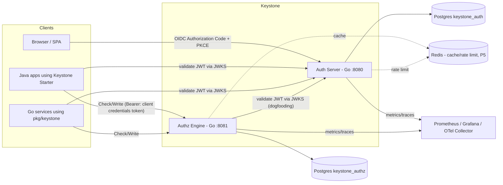

# Keystone

[](https://github.com/raviteja-core/keystone/actions/workflows/ci.yml)
[](LICENSE)
[](go.mod)
[](java/pom.xml)

A high-assurance, self-hosted **Identity & Relationship-Based Authorization (ReBAC) platform** designed as a drop-in foundation for modern microservices and multi-tenant applications.

---

## 1. Architecture Overview

Keystone decouples authentication and authorization into two specialized Go microservices backed by PostgreSQL, coupled with native SDKs and a Spring Boot starter:

1. **Auth Server (Go `:8080` / `:9100`):** OAuth 2.0 / OpenID Connect authorization server issuing RS256 JWT access tokens (`at+jwt`), rotating refresh tokens, and managing user identities.
2. **Authz Engine (Go `:8081` / `:9101`):** Google-Zanzibar-inspired ReBAC engine evaluating relationship tuples and user permissions with snapshot consistency (zookies).
3. **Spring Boot Starter (Java 25):** Drop-in auto-configuration library providing declarative method security (`@RequiresPermission`) and JWT validation.
4. **Go SDK (`pkg/keystone`):** Middleware and API client for native Go services.



---

## 2. Quickstart

Get the entire Keystone platform running locally in three commands:

```bash
# 1. Clone repository & configure environment
cp .env.example .env

# 2. Generate random 32-byte master key for AES-256-GCM encryption at rest
make dev-secrets

# 3. Spin up PostgreSQL and both Keystone microservices
docker compose up -d --build
```

Verify service readiness:
```bash
# Auth Server readiness (checks database connection & migrations)
curl -i http://localhost:9100/readyz

# Authz Engine readiness
curl -i http://localhost:9101/readyz
```

---

## 3. Real Walkthrough (Tested From Clean Clone)

This end-to-end walkthrough uses only standard tools (`curl`, `python3` or `openssl`) and works copy-paste directly against a running local instance.

### Step 1: Provision OAuth Client & Demo User
Use `keystonectl` to register a confidential client and an initial user:

```bash
# 1. Provision confidential OAuth2 client
go run ./cmd/keystonectl client create \
  --client-id demo-client \
  --name "Demo Application" \
  --type confidential \
  --redirect-uris "http://localhost:3000/callback" \
  --grant-types "authorization_code,refresh_token,client_credentials" \
  --scopes "openid,profile,email" \
  --require-consent=false

# Note the printed CLIENT SECRET (e.g. export CLIENT_SECRET="...")

# 2. Provision demo user with Argon2id password hash
go run ./cmd/keystonectl user create \
  --email alice@example.com \
  --password "Password1234!" \
  --username alice
```

### Step 2: Machine-to-Machine Token (Client Credentials)
```bash
curl -s -X POST http://localhost:8080/token \
  -d "grant_type=client_credentials&client_id=demo-client&client_secret=$CLIENT_SECRET"
```

Response:
```json
{
  "access_token": "eyJhbGciOiJSUzI1NiIsImtpZCI6Ii4uLiIsInR5cCI6ImF0K2p3dCJ9...",
  "token_type": "Bearer",
  "expires_in": 600,
  "scope": "openid profile email"
}
```

### Step 3: Interactive Authorization Code Flow with PKCE (S256)

#### A. Generate PKCE Verifier & Challenge
```bash
# Generate high-entropy verifier (43 characters URL-safe)
VERIFIER=$(openssl rand -base64 32 | tr -d '=/+' | cut -c1-43)

# Compute S256 code_challenge = BASE64URL(SHA256(verifier))
CHALLENGE=$(printf "%s" "$VERIFIER" | openssl dgst -sha256 -binary | openssl base64 -A | tr '+/' '-_' | tr -d '=')
```

#### B. Authenticate via Keystone Login Form
```bash
# Fetch login page and extract anti-CSRF token & cookie
COOKIE_JAR=$(mktemp)
CSRF_TOKEN=$(curl -s -c "$COOKIE_JAR" http://localhost:8080/login | grep 'name="csrf_token"' | sed -E 's/.*value="([^"]+)".*/\1/')

# Submit user credentials
curl -s -b "$COOKIE_JAR" -c "$COOKIE_JAR" -X POST http://localhost:8080/login \
  -d "email=alice@example.com&password=Password1234!&csrf_token=$CSRF_TOKEN"
```

#### C. Request Authorization Code
```bash
# Send authorization request (follows redirect to callback containing code)
AUTH_RESP=$(curl -s -i -b "$COOKIE_JAR" \
  "http://localhost:8080/authorize?response_type=code&client_id=demo-client&redirect_uri=http://localhost:3000/callback&scope=openid%20profile%20email&state=xyz123&code_challenge=$CHALLENGE&code_challenge_method=S256")

# Extract authorization code from Location header
AUTH_CODE=$(echo "$AUTH_RESP" | grep -i "location:" | sed -E 's/.*code=([^& ]+).*/\1/' | tr -d '\r')
rm -f "$COOKIE_JAR"
```

#### D. Exchange Code at `/token`
```bash
TOKEN_RESP=$(curl -s -X POST http://localhost:8080/token \
  -d "grant_type=authorization_code" \
  -d "code=$AUTH_CODE" \
  -d "redirect_uri=http://localhost:3000/callback" \
  -d "client_id=demo-client" \
  -d "client_secret=$CLIENT_SECRET" \
  -d "code_verifier=$VERIFIER")

ACCESS_TOKEN=$(echo "$TOKEN_RESP" | python3 -c "import sys, json; print(json.load(sys.stdin)['access_token'])")
REFRESH_TOKEN=$(echo "$TOKEN_RESP" | python3 -c "import sys, json; print(json.load(sys.stdin).get('refresh_token', ''))")
```

#### E. Call `/userinfo` with RS256 Bearer Token
```bash
curl -s -H "Authorization: Bearer $ACCESS_TOKEN" http://localhost:8080/userinfo
```

Output:
```json
{
  "sub": "01a101bf-9023-770a-8836-15b03f695a2a",
  "preferred_username": "alice",
  "email": "alice@example.com",
  "email_verified": true,
  "updated_at": 1791030759
}
```

#### F. Refresh Token Rotation & Replay Protection
```bash
# 1. Rotate refresh token (returns brand new access + refresh token)
ROTATED_RESP=$(curl -s -X POST http://localhost:8080/token \
  -d "grant_type=refresh_token" \
  -d "refresh_token=$REFRESH_TOKEN" \
  -d "client_id=demo-client" \
  -d "client_secret=$CLIENT_SECRET")

# 2. Replay the OLD refresh token (detected as replay -> immediately revokes family)
curl -s -X POST http://localhost:8080/token \
  -d "grant_type=refresh_token" \
  -d "refresh_token=$REFRESH_TOKEN" \
  -d "client_id=demo-client" \
  -d "client_secret=$CLIENT_SECRET"
```

Output:
```json
{
  "error": "invalid_grant",
  "error_description": "refresh token has been revoked or reused"
}
```

---

## 4. Standards Conformance Baseline

| Specification | Implementation Details | Conformance Status |
|---|---|---|
| **RFC 6749** | OAuth 2.0 (Authorization Code, Client Credentials, Refresh Token) | Conforms |
| **RFC 7636** | PKCE (Mandatory S256 challenge for all clients) | Conforms |
| **RFC 9700** | OAuth 2.0 Security BCP (BCP 240, strict redirect match, code binding) | Conforms |
| **RFC 9068** | JWT Profile for OAuth 2.0 Access Tokens (`typ: at+jwt`, RS256) | Conforms |
| **RFC 9106 / OWASP** | Argon2id password hashing ($m=65536, t=3, p=4$) | Exceeds minimums |
| **RFC 7517 / RFC 8414** | JWKS (`/jwks.json`) and OIDC Discovery (`/.well-known/openid-configuration`) | Conforms |
| **Google Zanzibar** | Relationship tuples, userset rewrites, monotonic zookie consistency | In Progress (P2) |

---

## 5. Security Principles

- **Fail Closed:** Any error in authentication or relationship traversal yields `deny`.
- **Zero Plaintext Secrets:** Passwords hashed with Argon2id; high-entropy tokens and client secrets stored as SHA-256 digests; signing keys encrypted at rest with AES-256-GCM.
- **Strict Algorithm Allowlisting:** Only `RS256` accepted for token verification; `alg=none` and HMAC algorithm-confusion attacks are strictly rejected.
- **Least Privilege Storage:** Dedicated PostgreSQL database and role per service (`keystone_auth` and `keystone_authz`) with append-only tamper-evident audit triggers.
- **Defensive HTTP Stack:** Non-root distroless container runtime, hardened connection timeouts, size-bounded request bodies, and Content Security Policy headers.

---

## 6. Honest Limitations & Non-Goals (v0.1.0)

Keystone v0.1.0 represents the **Phase 1 Authentication Core MVP**. To maintain strict engineering honesty, the following capabilities are explicitly **NOT** implemented in this release:

1. **No MFA Yet:** Multi-factor authentication (TOTP / WebAuthn / FIDO2) is planned for Phase 5. Current authentication relies on password + session/CSRF.
2. **No Email Verification / Password Reset Yet:** User accounts created via UI default to unverified email; self-service forgot-password flows via email token are scheduled for Phase 5.
3. **No Rate Limiting Yet:** Redis-backed sliding-window rate limiting on `/login` and `/token` is scheduled for Phase 5. (Argon2id CPU exhaustion is mitigated by an in-memory concurrency semaphore).
4. **Local Master Key, Not Cloud KMS:** Private signing keys are encrypted at rest with AES-256-GCM using `KEYSTONE_MASTER_KEY` from the environment. Integration with AWS KMS, GCP KMS, or HashiCorp Vault is required for production key custody.
5. **Not Production-Grade:** v0.1.0 is a verified architectural baseline and developer milestone. It has not undergone an independent third-party penetration test.

---

## 7. Development & Testing

```bash
# Format code
make fmt

# Run static analysis and linters (golangci-lint, go vet)
make lint

# Run Go unit/integration tests with race detector and Maven tests
make test

# Scan Go toolchain and dependencies for vulnerabilities
make vuln

# Tear down local containers and persistent volumes
make down
```
